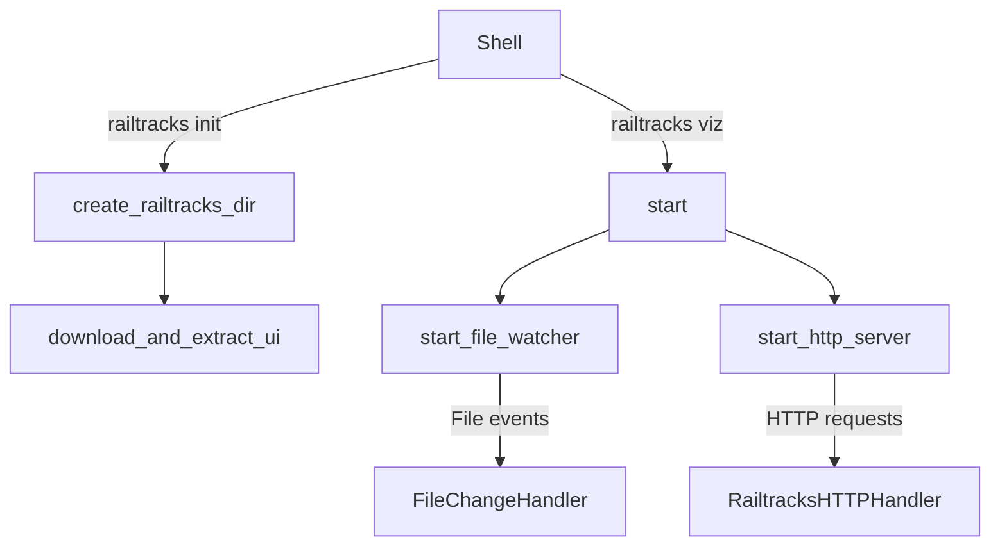

<!--
Feature Documentation – CLI Interface
=====================================
Keep this comment block until you have verified that the guidance below has been fully
addressed and that all placeholders have been replaced.
-->

# CLI Interface

Provides a developer-friendly command-line interface for initializing a Railtracks
workspace and launching the local visualization server.

**Version:** 0.0.1 <!-- Bump on any externally-observable change. -->

## Table of Contents

- [1. Functional Overview](#1-functional-overview)
  - [1.1 Environment Initialization (`railtracks init`)](#11-environment-initialization-railtracks-init)
  - [1.2 Development Server / Visualizer (`railtracks viz`)](#12-development-server--visualizer-railtracks-viz)
- [2. External Contracts](#2-external-contracts)
  - [2.1 CLI Commands](#21-cli-commands)
  - [2.2 HTTP Endpoints](#22-http-endpoints)
  - [2.3 Configuration & Flags](#23-configuration--flags)
- [3. Design and Architecture](#3-design-and-architecture)
  - [3.1 Control-Flow Overview](#31-control-flow-overview)
  - [3.2 File-Watcher Pipeline](#32-file-watcher-pipeline)
  - [3.3 HTTP Serving Pipeline](#33-http-serving-pipeline)
  - [3.4 Design Decisions & Trade-offs](#34-design-decisions--trade-offs)
- [4. Related Files](#4-related-files)
  - [4.1 Related Component Files](#41-related-component-files)
  - [4.2 External Dependencies](#42-external-dependencies)
- [CHANGELOG](#changelog)

---

## 1. Functional Overview

The CLI interface exposes two primary task sets that together streamline the
developer experience around Railtracks:

* create a self-contained **workspace** with all required frontend assets, and  
* spin up a **local web server** for inspecting and interacting with runtime
  data (JSON state, logs, etc.).

Although the underlying implementation lives in
`packages/railtracks-cli/src/railtracks_cli`, developers interact exclusively
through a single shell command: `railtracks`.

### 1.1 Environment Initialization (`railtracks init`)

Prepares a project directory for Railtracks development.

Responsibilities  
• Creates a hidden workspace directory `.railtracks/`  
• Ensures `.railtracks/` is listed in `.gitignore`  
• Downloads the latest standalone UI bundle and unpacks it into
  `.railtracks/ui/`  

```bash
# one-time setup per repository
$ railtracks init
[railtracks] Creating .railtracks directory...
[railtracks] Downloading latest frontend UI...
[railtracks] 🚀 railtracks initialization completed!
```

Developers can safely commit the rest of their repository while keeping the
large UI bundle out of version control.

### 1.2 Development Server / Visualizer (`railtracks viz`)

Launches a file-watching HTTP server backed by Python’s `http.server`
module.  The server:

* hosts static files from `.railtracks/ui/` on
  `http://localhost:3030` (default),
* exposes a lightweight JSON API for the UI, and
* monitors `.railtracks/*.json` files, surfacing real-time changes to the
  browser via an `/api/refresh` flag.

```bash
# start interactive visualizer
$ railtracks viz
[railtracks] 🚀 railtracks server running at http://localhost:3030
[railtracks] 📁 Serving files from: .railtracks/ui/
[railtracks] 👀 Watching for changes in: .railtracks/
```

Any JSON file dropped into `.railtracks/` immediately appears in the web UI,
making it ideal for debugging long-running sessions or inspecting serialized
state.

---

## 2. External Contracts

### 2.1 CLI Commands

| Command                | Description                               | Owned By | Notes |
| ---------------------- | ----------------------------------------- | -------- | ----- |
| `railtracks init`      | Bootstrap local workspace and download UI | CLI Interface | Idempotent; safe to re-run |
| `railtracks viz`       | Start development server (port 3030)      | CLI Interface | Creates `.railtracks/` if missing |
| `python -m railtracks_cli` | Low-level entry point; identical to `railtracks` wrapper | CLI Entry Point | Provided for parity with `python -m` patterns |

### 2.2 HTTP Endpoints

| Endpoint               | Method | Description                                  | Delivered By |
| ---------------------- | ------ | -------------------------------------------- | ------------ |
| `/api/files`           | GET    | Returns an array of available `.json` files  | `RailtracksHTTPHandler.handle_api_files` |
| `/api/json/<name>`     | GET    | Returns raw JSON content of given file       | `handle_api_json` |
| `/api/refresh`         | POST   | UI polls to trigger live reload              | `handle_refresh` |
| `/*`                   | GET    | Serves static UI assets, SPA fallback to `index.html` | `serve_static_file` |

All endpoints add `Access-Control-Allow-Origin: *`, allowing the UI bundle to
be hosted separately during development if desired.

### 2.3 Configuration & Flags

| Name                   | Default | Purpose                                          |
| ---------------------- | ------- | ------------------------------------------------ |
| `PORT` (up-coming)     | `3030`  | Expected future enhancement for custom ports     |
| `RAILTRACKS_UI_URL`    | internal constant (`latest_ui_url`) | Override download source for offline testing |

The current code does not parse environment variables; contributions are
welcome to surface these as proper CLI flags (`-p`, `--ui-url`, etc.).

---

## 3. Design and Architecture

### 3.1 Control-Flow Overview



* **`create_railtracks_dir()`** — guarantees workspace & `.gitignore` entry  
* **`download_and_extract_ui()`** — pulls a zip bundle ‑> `.railtracks/ui/`  
* **`start_file_watcher()`** — `watchdog.Observer` debounces JSON changes  
* **`start_http_server()`** — `HTTPServer` bound to `RailtracksHTTPHandler`  
* File & HTTP stages run concurrently (`threading.Thread` for watcher).

### 3.2 File-Watcher Pipeline

1. `watchdog.Observer` recursively monitors `.railtracks/`.
2. `FileChangeHandler.on_modified` filters for `.json` files.
3. Debounce logic (`DEBOUNCE_INTERVAL = 0.5 s`) suppresses rapid events.
4. A console status line is printed; the UI polls `/api/refresh` to reflect
   changes.

No direct IPC is required—simply touching/rewriting JSON files is enough.

### 3.3 HTTP Serving Pipeline

* **Static content** — path-based routing; unknown routes fall back to SPA
  `index.html` enabling client-side routing.
* **JSON API** — thin wrappers around `Path.glob("*.json")` and file I/O.
* **CORS** — wildcard origin for local development convenience.
* **Logging** — overridden `BaseHTTPRequestHandler.log_message` hooks into
  `print_status()` for unified, color-ready console output.

### 3.4 Design Decisions & Trade-offs

| Decision | Rationale | Trade-off |
| -------- | --------- | --------- |
| Pure-Python `http.server` | Zero external dependency; easy to embed | Limited performance; no TLS |
| Bundled UI via zip | Offline-friendly; single download | Requires re-download on every version bump |
| File polling via `watchdog` | Cross-platform file events | Adds optional runtime dependency |
| Workspace in `.railtracks/` | Keeps repo clean, easily ignored | Hidden directory may confuse newcomers |
| No global install assumed | Encourages `pip install -e` monorepo pattern | Requires `python -m railtracks_cli` for alias-less use |

Future improvements (tracked via GitHub Issues):

* expose `--port`, `--ui-url`, `--debug` flags,
* TLS & auth support for secure remote demos,
* pluggable back-end to serve live protobuf/log streams.

---

## 4. Related Files

### 4.1 Related Component Files

- [`../components/cli_entry_point.md`](../components/cli_entry_point.md):  
  Tracks the minimal `__main__.py` shim that funnels `python -m` execution into
  the CLI.
- [`../components/logging_configuration.md`](../components/logging_configuration.md):  
  Explains the shared helper utilities used by `print_status`, `print_success`,
  etc. (colour, formatting).
- [`../components/pubsub_messaging.md`](../components/pubsub_messaging.md):  
  The UI relies on Pub/Sub topics documented here when embedded within broader
  Railtracks deployments.

### 4.2 External Dependencies

- [`https://pypi.org/project/watchdog`](https://pypi.org/project/watchdog):  
  Cross-platform filesystem event monitoring.
- [`https://pypi.org/project/ruff`](https://pypi.org/project/ruff)  
  (dev-only) linting, referenced in `pyproject.toml`.

---

## CHANGELOG

- **v0.0.1** (YYYY-MM-DD) `<COMMIT_HASH>`: Initial feature documentation.