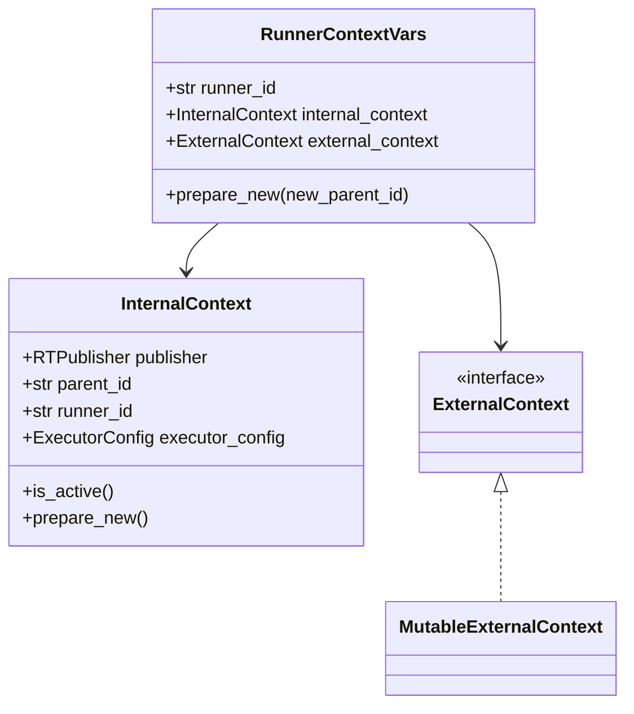

<!--
Context Management Feature Documentation
========================================
This file follows `TEMPLATE_FEATURE.md`.  
Delete instructional comments once you feel the document is mature.
-->

# Context Management

Provides a unified mechanism for propagating execution-scoped information (IDs, configs, variables, loggers, publishers) across asynchronous and multi-threaded code paths without leaking state between concurrent runners.

**Version:** 0.0.1 <!-- bump on externally-observable change -->

## Table of Contents

- [1. Functional Overview](#1-functional-overview)
- [2. External Contracts](#2-external-contracts)
- [3. Design and Architecture](#3-design-and-architecture)
- [4. Related Files](#4-related-files)
- [CHANGELOG](#changelog)

---

## 1. Functional Overview

The feature answers the question: *“How do I attach per-request data (IDs, configs, scratch-space) to the current execution and retrieve it from anywhere in the call-stack—sync or async—without manually passing arguments?”*

It is built around a thin facade, `railtracks.context.central`, which exposes helpers for:

1. Creating an execution “runner” and registering its context  
2. Reading / mutating context variables at any depth in the code path  
3. Customising global & per-runner `ExecutorConfig`  
4. Starting / shutting down the pub-sub `RTPublisher` tied to the runner  
5. Safely detecting absence of context to avoid misuse outside an active session

The following task sets illustrate typical usage.

### 1.1 Runner Context Life-Cycle

Create, activate, use, and finally tear down a runner context.

```python
import railtracks.context.central as ctx
from railtracks.utils.config import ExecutorConfig

# --- bootstrapping (normally done by high-level rt.Session) -------------
ctx.register_globals(
    runner_id="runner_42",
    rt_publisher=None,
    parent_id=None,
    executor_config=ExecutorConfig(timeout=90.0),
    global_context_vars={"user_id": "u_123"}
)

# --- anywhere deep in the call-stack -----------------------------------
assert ctx.is_context_present()
print("Runner:", ctx.get_runner_id())           # ➜ runner_42
print("User  :", ctx.get("user_id"))            # ➜ u_123

# Update parent_id when spawning a child node
ctx.update_parent_id("node_a")

# Tear-down (handled automatically by Session end)
ctx.delete_globals()
```

### 1.2 External Context Variable CRUD

The external context is a mutable key-value store designed for arbitrary, user-defined data.

```python
from railtracks.context.central import get, put, update, delete

put("trace_id", "abc-xyz")
assert get("trace_id") == "abc-xyz"

update({"stage": "pre-processing", "retry": 0})
delete("trace_id")
```

### 1.3 Dynamic Executor Configuration

Fine-tune behaviour for **all** future runners (global) or **just the current** runner (local).

```python
from railtracks.context.central import set_config, set_local_config, get_global_config

# Affect future runners only
set_config(timeout=300.0, logging_setting="DEBUG")

# Locally override within this runner
from railtracks.utils.config import ExecutorConfig
set_local_config(ExecutorConfig(timeout=30.0, end_on_error=True))

print(get_global_config().timeout)     # ➜ 300.0
```

---

## 2. External Contracts

Other subsystems rely on the *implicit* presence of a runner context rather than formal network APIs or CLIs. The table below documents these contracts.

### 2.1 Implicit Contracts

| Contract                                   | Producer / Consumer                       | Notes                                                                                              |
| ------------------------------------------ | ----------------------------------------- | --------------------------------------------------------------------------------------------------- |
| `runner_context` (`contextvars.ContextVar`) | Producer: `railtracks.context.central`<br>Consumer: **ALL** internal modules that call `central.safe_get_runner_context()` | Accessing it without a registered context raises `ContextError`. |
| `global_executor_config` (`ContextVar`)    | Producer: `central.set_config()`          | Supplies default `ExecutorConfig` to new runners.                                                   |
| Pub-Sub `RTPublisher`                      | Producer: `central.activate_publisher()`  | Must be started before emission; shutting down is mandatory to flush buffers.                       |

### 2.2 Configuration & Flags

| Name/Call                                        | Scope  | Purpose                                                            |
| ------------------------------------------------ | ------ | ------------------------------------------------------------------ |
| `set_config(**kwargs)`                           | global | Mutate defaults for future runners; warns if called after start.   |
| `ExecutorConfig.prompt_injection`                | per run| Enables automatic context injection into LLM prompts.              |
| `ExecutorConfig.save_state`                      | per run| Persist execution state to disk for replay/debug.                  |

---

## 3. Design and Architecture

The feature is realised by the **Context Management component** ([docs](../components/context_management.md)). Below is a feature-level narrative; component-level details live in that document.

### 3.1 Core Abstractions



• **RunnerContextVars** – Immutable container installed into a `ContextVar`.  
• **InternalContext** – RT-specific, readonly to most callers; tracks publisher, parent ID, config.  
• **ExternalContext** – User-facing scratch-space with CRUD operations.  

### 3.2 Data & Control Flow

1. `register_globals()` constructs **RunnerContextVars** and stores it in `runner_context`.  
2. Any function can call `safe_get_runner_context()`; the lookup walks **only the current async context** guaranteeing isolation between concurrent tasks.  
3. The attached `RTPublisher` is lazily started by `activate_publisher()`—decoupling publication from bootstrap time.  
4. When a node spawns children, it calls `update_parent_id()`; this returns a **new** RunnerContextVars instance ensuring *structural sharing* but new parent linkage.  

### 3.3 Trade-offs & Rationale

| Decision                                 | Reasoning                                                                                     | Trade-off / Mitigation                                                  |
| ---------------------------------------- | --------------------------------------------------------------------------------------------- | ----------------------------------------------------------------------- |
| `contextvars` over thread-locals         | Works across `asyncio`, `trio`, and threads.                                                  | Slight lookup overhead; negligible compared to I/O-bound workload.      |
| Immutable `RunnerContextVars` replacement | Easier reasoning; prevents accidental side-effects between libraries.                         | Extra allocations; insignificant (dozens per execution tree).           |
| Separate Internal vs External Context    | Keeps RT-private machinery from polluting user dictionary and vice-versa.                     | Double indirection when both are needed; encapsulated by helper funcs.  |
| Global `ExecutorConfig` ContextVar       | Allows default-overrides **without** mutating process-wide globals (test isolation).          | Must warn if a runner is already active – implemented via `warnings`.   |
| No automatic publisher start on register | Forces explicit intention; avoids IO in code paths that only need context vars.               | Requires documentation (`activate_publisher()`); safeguarded by checks. |

### 3.4 Rejected Alternatives

- **Passing context down the call-stack manually** – tedious, brittle, breaks 3rd-party API boundaries.  
- **Single global module-level dict** – unsafe in concurrent runners; leaks state across tests.  
- **`threading.local()`** – fails for `asyncio` coroutines that share threads.  

---

## 4. Related Files

### 4.1 Related Component Files

- [`../components/context_management.md`](../components/context_management.md): Low-level API and implementation rationale.
- [`../components/executor_configuration.md`](../components/executor_configuration.md): In-depth description of `ExecutorConfig`.

### 4.2 Related Feature Files

- [`../features/logging_profiling.md`](../features/logging_profiling.md): Context’s `ExecutorConfig.logging_setting` interacts with logging feature.
- [`../features/task_execution.md`](../features/task_execution.md): Task executor consumes runner context to honour timeouts and cancellation.

### 4.3 External Dependencies

- [`https://docs.python.org/3/library/contextvars.html`](https://docs.python.org/3/library/contextvars.html) – Python std-lib mechanism underpinning isolation.

---

## CHANGELOG

- **v0.0.1** (YYYY-MM-DD) [`<COMMIT_HASH>`]: Initial creation of feature documentation.