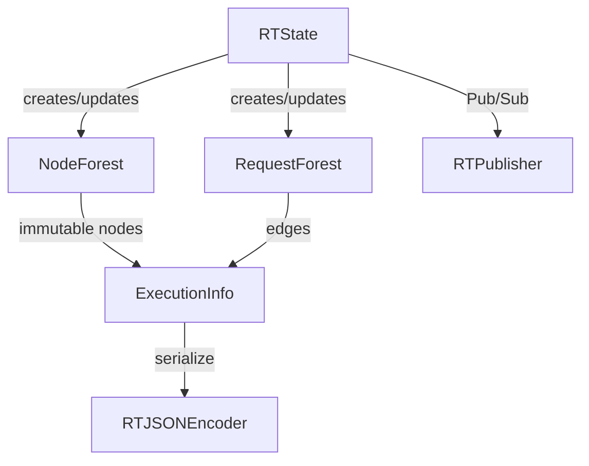

<!--
Feature Documentation for State Management
Generated according to TEMPLATE_FEATURE.md
-->

# State Management

End-to-end facilities for capturing, mutating, and querying the *entire* runtime state of a RailTracks execution—including nodes, requests, timestamps, graph relationships, and serialization to external systems.

**Version:** 0.0.1 <!-- Bump on any externally-observable change. -->

## Table of Contents

- [1. Functional Overview](#1-functional-overview)
- [2. External Contracts](#2-external-contracts)
- [3. Design and Architecture](#3-design-and-architecture)
- [4. Related Files](#4-related-files)
- [CHANGELOG](#changelog)

---

## 1. Functional Overview

The State Management feature is the canonical source of truth for *what is happening* inside RailTracks at any moment.  
It combines multiple cooperating components—`Forest`, `NodeForest`, `RequestForest`, `ExecutionInfo`, `RTState`, utility helpers, and custom (de)serialization—to deliver:

• Historical object tracking (“time-travel”)  
• Request lifecycle orchestration and visibility  
• Graph-based introspection of nodes ↔ requests ↔ timestamps  
• Snapshotting for UIs / analytics  
• Safe, JSON-serializable exports for remote consumers

### 1.1 Object History & “Time-Travel”

At the lowest level, immutable objects are stored in a [`Forest`](../components/state_management.md) indexed by identifier.  
Developers can *rewind* the heap to any logical **step** using `Forest.time_machine()`.

```python
from railtracks.state.forest import Forest, AbstractLinkedObject
from railtracks.utils.profiling import Stamp

class ConfigSnapshot(AbstractLinkedObject):
    ...

snapshots = Forest[ConfigSnapshot]()
stamp1 = Stamp(step=1, identifier="init")
snapshots._update_heap(ConfigSnapshot("cfg", stamp1, parent=None))

# Later …
snapshots.time_machine(step=1)        # Heap is now identical to step == 1
```

### 1.2 Request Lifecycle Tracking

Requests between nodes are first-class citizens represented by [`RequestForest`](../components/request_management.md).  
Creating, updating, and querying requests gives developers full visibility into in-flight work.

```python
from railtracks.state.request import RequestForest
from railtracks.utils.profiling import Stamp

rf = RequestForest()
req_id = rf.create(
    identifier="my_req", source_id=None, sink_id="node_a",
    input_args=(), input_kwargs={}, stamp=Stamp()
)

# Mark as finished later on
rf.update(req_id, output="ok ✅", stamp=Stamp())
```

### 1.3 Execution Snapshots & Graph Visualisation

`ExecutionInfo` bundles *all* active `NodeForest`, `RequestForest`, and `StampManager` data into a single immutable snapshot.  
Its `.graph_serialization()` helper turns the snapshot into a UI-friendly JSON graph.

```python
from railtracks.state.info import ExecutionInfo

snapshot = ExecutionInfo.create_new()
json_graph = snapshot.graph_serialization()        # <- ready for front-end
```

### 1.4 Runtime Orchestration (`RTState`)

[`RTState`](../components/rt_state_management.md) is the orchestrator that:

1. Creates nodes + requests (`_create_node_and_request`)
2. Executes tasks asynchronously via the **Coordinator**
3. Mutates forests on success / failure
4. Publishes Pub/Sub events for observability

```python
state = RTState(
    execution_info=ExecutionInfo.create_new(),
    executor_config=my_cfg,
    coordinator=my_coordinator,
    publisher=my_pub
)

await state.call_nodes(
    parent_node_id=None,
    request_id=None,
    node=MyNode,          # subclass of railtracks.nodes.Node
    args=(), kwargs={}
)
```

### 1.5 Sub-State Extraction for Debugging

`create_sub_state_info()` (see [`State Utilities`](../components/state_utilities.md)) lets you isolate *just the downstream branch* of a node or request—perfect for error isolation or focused UI views.

```python
from railtracks.state.utils import create_sub_state_info

sub_nodes, sub_reqs = create_sub_state_info(
    node_heap=snapshot.node_forest.heap(),
    request_heap=snapshot.request_forest.heap(),
    parent_ids="root_request_id"
)
```

## 2. External Contracts

### 2.1 Pub/Sub Messages

`RTState` publishes the following message types (see `railtracks/pubsub/messages.py`):

| Message                                   | When Emitted                               | Owned By |
| ----------------------------------------- | -------------------------------------------|----------|
| `RequestCreation`                         | Before a node is executed                  | [RT State Management](../components/rt_state_management.md) |
| `RequestSuccess` / `RequestFailure`       | After task completion                      | Same |
| `FatalFailure`                            | Fatal, system-terminating error occurred   | Same |

Down-stream systems (CLI visualiser, HTTP server, etc.) subscribe to these messages to update live dashboards.

### 2.2 Configuration & Flags

| Name                     | Default | Purpose                                          |
| ------------------------ | ------- | ------------------------------------------------ |
| `executor_config.end_on_error` | `False` | If `True`, any error triggers a `FatalFailure` broadcast and shutdown. |

No dedicated environment variables are required; all knobs reside in [`ExecutorConfig`](../components/executor_configuration.md).

## 3. Design and Architecture

### 3.1 High-Level View



1. **Forests** provide O(1) access to “head” objects + linked-list history.  
2. **RTState** is a façade combining execution, exception handling, and forest mutation.  
3. **ExecutionInfo** is the *read-model* exported to UIs / tests.  
4. **Serialization** via [`RTJSONEncoder`](../components/serialization.md) guarantees that complex objects (`Edge`, `Vertex`, `Stamp`, Pydantic models, …) round-trip to JSON.

### 3.2 Core Design Decisions

| Decision | Rationale | Trade-offs |
|----------|-----------|-----------|
| Immutable linked objects (`parent` chain) | Makes “time-travel” trivial; no deep copies during reads | More memory usage vs. in-place mutation |
| Re-entrant lock per `Forest` | Simple thread-safety without requiring external synchronisation | Global write lock per heap limits parallel write throughput |
| Asynchronous task execution (via `Coordinator`) | High throughput, supports external LLM calls | Requires careful exception propagation |
| Single custom JSON encoder | Centralises (de)serialization rules | Needs manual upkeep when adding new types |

### 3.3 Alternatives Considered

• **Full event-sourcing** (append-only log) – rejected for initial simplicity; could be layered in later.  
• **Relational DB storage** – overkill for in-memory, single-process execution; would hurt latency.

## 4. Related Files

### 4.1 Related Component Files

- [`../components/state_management.md`](../components/state_management.md): Low-level `Forest` mechanics and history management.
- [`../components/node_state_management.md`](../components/node_state_management.md): Node storage & vertex conversion.
- [`../components/request_management.md`](../components/request_management.md): Request graph and status helpers.
- [`../components/execution_info.md`](../components/execution_info.md): Snapshot model and graph export.
- [`../components/rt_state_management.md`](../components/rt_state_management.md): Orchestrator for live executions.
- [`../components/serialization.md`](../components/serialization.md): `RTJSONEncoder` and encoder helper functions.
- [`../components/state_utilities.md`](../components/state_utilities.md): Sub-state slicing helpers.
- [`../components/graph_serialization.md`](../components/graph_serialization.md): `Edge` and `Vertex` data models.

### 4.2 External Dependencies

- [`pydantic`](https://docs.pydantic.dev/) – required for serialising `BaseModel` objects.
- [`mermaid`](https://mermaid.js.org) – diagrams in docs only; no runtime dependency.

---

## CHANGELOG

- **v0.0.1** (2024-05-29) [`<COMMIT_HASH>`]: Initial extraction from codebase into formal documentation.