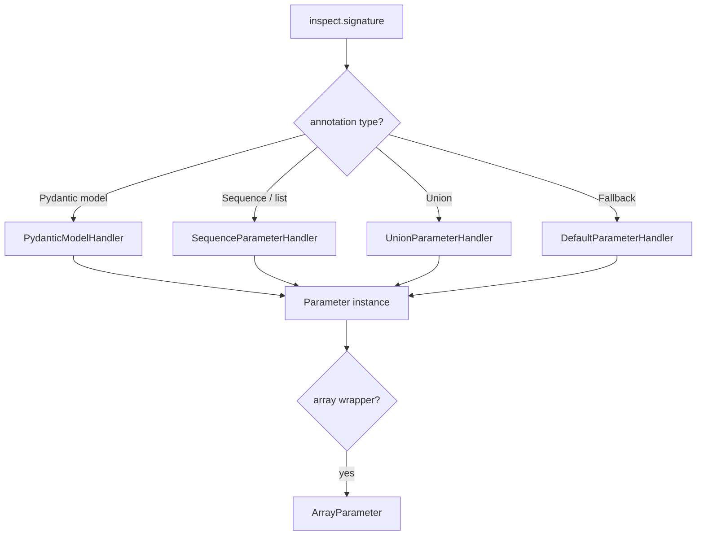

<!--
NOTE TO MAINTAINERS:
‣ Replace placeholders if any remain.
‣ Keep the CHANGELOG at the bottom in sync with version bumps.
‣ This file lives at docs/raw/features/tool_management.md (refer to it with
  `features/tool_management.md` from inside other docs).
-->

# Tool Management

Provides end-to-end “tool calling” support: from automatically turning a Python
function or MCP-supplied tool into an internal `Tool` object, to serialising
that object into a LiteLLM-compatible JSON-Schema, to routing the model’s
`tool_call` response back into executable Python code.  
In short, this feature is the glue that lets an LLM discover, request, and run
business-logic functions at runtime.

**Version:** 0.0.1

## Table of Contents

- [1. Functional Overview](#1-functional-overview)  
- [2. External Contracts](#2-external-contracts)  
- [3. Design and Architecture](#3-design-and-architecture)  
- [4. Related Files](#4-related-files)  
- [CHANGELOG](#changelog)

---

## 1. Functional Overview

From a package user’s perspective, Tool Management offers two main task sets:
(1) registering tools, and (2) invoking an LLM with those tools enabled.

```mermaid
flowchart LR
    subgraph Dev
        A[Write function or import MCP tool]
        B[Tool.from_function / Tool.from_mcp]
        C[Tool instance]
    end
    subgraph Runtime
        C --> D[LiteLLMWrapper._chat_with_tools()]
        D -->|serialised JSON-Schema| E[litellm.completion]
        E -->|tool_call| F[ToolCall objects]
        F --> G[execute Python function]
    end
```

### 1.1  Registering a Python Function as a Tool

```python
from railtracks.llm.tools import Tool

def translate(text: str, target_lang: str = "fr") -> str:
    """
    Translate `text` into the target language.

    Args:
        text: The text to translate.
        target_lang (str): Destination language (ISO-639-1 code).
    """
    # … implementation …
    return "bonjour"

translation_tool = Tool.from_function(translate)
```

Behind the scenes:

1. `Tool.from_function()` introspects the function’s type annotations.  
2. `railtracks.llm.tools.docstring_parser.parse_docstring_args()` harvests
   per-parameter descriptions from the docstring.  
3. Each parameter is converted into a concrete `Parameter` subclass via a chain
   of `ParameterHandler`s (`PydanticModelHandler`, `SequenceParameterHandler`,
   etc.).

### 1.2  Exposing Tools to an LLM and Handling Calls

```python
from railtracks.llm.models import LiteLLMWrapper
from railtracks.llm.message import UserMessage, MessageHistory

model = LiteLLMWrapper("openai/gpt-4o-mini")

messages = MessageHistory(
    UserMessage(content="Translate 'hello' into French and Spanish.")
)

response = model.chat_with_tools(messages, tools=[translation_tool])

match response.message.content:
    case list(tool_calls):            # LLM requested one or more tools
        for call in tool_calls:       # call: railtracks.llm.content.ToolCall
            if call.name == translation_tool.name:
                result = translate(**call.arguments)
                # … emit ToolMessage(result) back to the model …
    case _:
        print(response.message.content)  # Plain assistant text
```

### 1.3  Importing an Existing MCP Tool

```python
from railtracks.llm.tools import Tool
from railtracks.rt_mcp import get_example_mcp_tool  # hypothetical helper

mcp_tool_handle = get_example_mcp_tool()
tool = Tool.from_mcp(mcp_tool_handle)
```

`Tool.from_mcp()` validates the MCP input schema (`type == "object"`) and
recursively converts it into internal `Parameter` objects via
`schema_parser.parse_json_schema_to_parameter()`.

---

## 2. External Contracts

Although Tool Management owns no HTTP endpoints, it defines binary contracts
between otherwise-decoupled subsystems.

### 2.1 JSON-Schema Sent to litellm

`railtracks.llm.models._litellm_wrapper._to_litellm_tool()` emits the exact
schema accepted by
[litellm.completion](https://github.com/berriai/litellm#chatcompletions).

Key guarantees:

| Field                                   | Format / Source                                |
| --------------------------------------- | ---------------------------------------------- |
| `function.name`                         | `Tool.name` – must be lower_snake_case.        |
| `function.description`                  | `Tool.detail` – first paragraph of docstring.  |
| `function.parameters`                   | Draft-07 JSON-Schema produced from `Parameter` |

Breaking this schema will break all downstream calls.

### 2.2 Environment Variables & Flags

None at the moment. (The surrounding LLM integration may rely on
`OPENAI_API_KEY`, but that is tracked in `features/llm_integration.md`.)

---

## 3. Design and Architecture

### 3.1  Core Data Model

| Concept             | Responsibility                                                                          |
| ------------------- | ---------------------------------------------------------------------------------------- |
| `Tool`              | Quasi-immutable value object. Holds `name`, `detail`, and a `Set[Parameter]` or raw JSON |
| `Parameter` family  | Declarative type system (`str`, `int`, union, arrays, nested objects/`Pydantic`)         |
| `ParameterHandler`  | Strategy pattern that converts a Python *annotation* into a concrete `Parameter`         |
| `ToolCall`          | Runtime request from model (`id`, `name`, `arguments`)                                   |

Key principles:

1. **Source-of-truth invariants** – the original Python function signature is
   not mutated; `Tool` objects are created, never modified.
2. **Graceful degradation** – when unable to parse a type (e.g., builtin C
   function without signature), `ToolCreationError` is raised with
   actionable “tips to debug”.
3. **Zero implementation coupling** – `Tool` knows nothing about LiteLLM;
   conversion happens in `_litellm_wrapper.py` to avoid back-references.

### 3.2  Parameter-Inference Pipeline



Trade-offs:

• **Performance vs flexibility** – we do the heavy regex/docstring parsing once
  at startup, trading some memory for runtime speed.  
• **Static vs dynamic typing** – Pydantic models are accepted verbatim to avoid
  duplicating validation logic.

### 3.3  Error-Handling Strategy

`ToolCreationError` derives from
[`RTLLMError`](components/exception_handling.md) and attaches a `notes` list
printed in green to standard error. This avoids noisy stack traces while still
surfacing actionable guidance.

Rejected alternative: returning `None` silently – deemed too brittle.

### 3.4  Execution Flow at Runtime

1. Developer registers tool(s).  
2. Wrapper converts tools to LiteLLM JSON schema and calls LLM.  
3. LLM returns `tool_call`(s) → marshalled into `ToolCall` dataclass.  
4. Caller inspects each `ToolCall` and dispatches to the actual Python
   function (often via a `ToolCallable` node helper).  
5. Optionally, the result is sent back to the model in a `ToolMessage`,
   enabling multi-step tool chains.

Concurrency: The `Tool` object is read-only after creation and therefore
thread-safe. The caller must still ensure the wrapped function is safe to
execute in the chosen concurrency model (async/thread/process).

---

## 4. Related Files

### 4.1 Related Component Files

- [`components/tool_management.md`](../components/tool_management.md) – houses
  lower-level implementation details and Public API stubs.  
- [`components/tool_parsing.md`](../components/tool_parsing.md) – deep-dives
  into docstring/JSON-Schema parsing logic used by this feature.

### 4.2 Key Code Files (linked indirectly through components)

- `railtracks/llm/tools/tool.py` – `Tool`, `ToolCreationError`, `from_function`,
  `from_mcp`.  
- `railtracks/llm/tools/docstring_parser.py` – regex utilities.  
- `railtracks/llm/tools/parameter_handlers.py` – strategy implementations.  
- `railtracks/llm/models/_litellm_wrapper.py` – `_to_litellm_tool`,
  `_chat_with_tools`, `ToolCall` deserialisation.

### 4.3 External Dependencies

- [`litellm`](https://github.com/BerriAI/litellm) – upstream library whose
  schema we target when sending tools to an LLM.  
- [`pydantic`](https://docs.pydantic.dev/) – leveraged for complex, nested
  parameter validation (see `PydanticModelHandler`).

---

## CHANGELOG

- **v0.0.1** (YYYY-MM-DD) [`<COMMIT_HASH>`]: Initial version – first complete
  end-to-end documentation of the Tool Management feature.