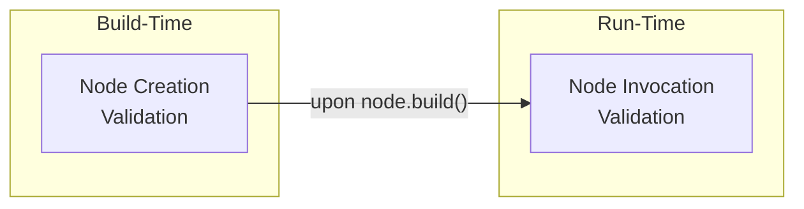

<!--
Feature documentation is written using TEMPLATE_FEATURE.md.
Remove instructional comments only when they no longer add value to readers.
-->

# Validation

Guarantees the structural integrity, safety, and correctness of nodes and their interactions by validating code and runtime inputs before execution.

**Version:** 0.0.1 <!-- Bump on any externally-observable change. -->

## Table of Contents

- [1. Functional Overview](#1-functional-overview)
- [2. External Contracts](#2-external-contracts)
- [3. Design and Architecture](#3-design-and-architecture)
- [4. Related Files](#4-related-files)
- [CHANGELOG](#changelog)

---

## 1. Functional Overview

The Validation feature is the project’s first line of defence against mis-configuration and malformed data.  
It is split into two complementary task sets:

1.  **Node Creation Validation** – runs at *build time* (graph construction, tool registration, etc.).
2.  **Node Invocation Validation** – runs at *execution time* (every node call).

Together they prevent subtle bugs from propagating into live executions, surface actionable error messages, and shield large language models (LLMs) from invalid prompts or unsafe schemas.

### 1.1 Node Creation Validation

Covers static and semi-static checks that can be performed before a node is ever invoked.

Key responsibilities  
• Ensure a node’s public function does not receive raw `dict` / mutable mapping types  
• Validate that required `@classmethod` APIs are implemented correctly  
• Verify tool metadata (params, details, pretty name, `SystemMessage`, max tool calls, …)  
• Confirm connected nodes belong to the declared `Node` hierarchy  
• Guard against malformed JSON Schema definitions produced by [`pydantic`](https://docs.pydantic.dev/) models

```python
from railtracks.validation.node_creation.validation import (
    validate_function,
    validate_tool_metadata,
)

# 1️⃣  Function signature validation
def unsafe_fn(a: int, b: dict):  # ❌ mutable dict
    ...

validate_function(unsafe_fn)  # ➜ raises NodeCreationError at build time


# 2️⃣  Tool metadata validation
tool_params  = [{'name': 'query'}, {'name': 'source'}]
tool_details = {'description': 'RAG search'}
system_msg   = SystemMessage(content="You are a helpful assistant.")

validate_tool_metadata(
    tool_params     = tool_params,
    tool_details    = tool_details,
    system_message  = system_msg,
    pretty_name     = "Search Tool",
    max_tool_calls  = 3,
)
```

> For deep-dive information see [`components/node_creation_validation.md`](../components/node_creation_validation.md).

### 1.2 Node Invocation Validation

Covers dynamic checks that can *only* be evaluated when the node is about to run.

Key responsibilities  
• Message history integrity (instances of `llm.Message`, presence of system message, etc.)  
• Availability of an `llm.ModelBase` instance  
• Enforcing (or warning about) `max_tool_calls`

```python
from railtracks.validation.node_invocation.validation import (
    check_message_history,
    check_llm_model,
    check_max_tool_calls,
)
from railtracks.llm import Message, MessageHistory, ModelBase

history = MessageHistory([
    Message(role="user", content="Hi!"),
])

check_message_history(history, system_message="You are ChatGPT")  # ✅ safe

llm_model = None
check_llm_model(llm_model)  # ➜ raises NodeInvocationError

check_max_tool_calls(0)     # ✅ allowed (no tool calls)
```

> For deep-dive information see [`components/node_invocation_validation.md`](../components/node_invocation_validation.md).

---

## 2. External Contracts

Validation operates purely in-process; it does **not** expose HTTP / gRPC endpoints or CLIs.  
However, consumers must understand the following contracts because *violating them triggers exceptions*.

### 2.1 Exceptions Raised

| Exception Class | Typical Triggers | Fatal? |
| --------------- | ---------------- | ------ |
| `railtracks.exceptions.errors.NodeCreationError`   | Invalid function sig, duplicate param names, classmethod missing, … | Yes |
| `railtracks.exceptions.errors.NodeInvocationError` | Missing model, wrong message type, negative `max_tool_calls`, …    | Yes/No (see `fatal` flag) |

Both exception classes surface *internationalised* messages and remediation notes retrieved from `railtracks.exceptions.messages.exception_messages`.

### 2.2 Warnings Emitted

Some non-fatal conditions emit a `warnings.warn` instead (e.g., unlimited tool calls).  
These can be upgraded to errors by enabling Python’s warning filters:

```bash
python -W "error::UserWarning" your_app.py
```

---

## 3. Design and Architecture

Validation is intentionally lightweight; its only dependency is `pydantic` for model inspection.  
Nevertheless, a few architectural decisions are critical for maintainability.

### 3.1 Two-Tier Validation Layer



1. **Node Creation Validation (VC)**  
   • Runs once per node definition.  
   • Throws *hard* errors because configuration mistakes should fail fast and fail early.

2. **Node Invocation Validation (VI)**  
   • Executes every time the node is called.  
   • May raise fatal errors **or** warnings, depending on whether the problem is recoverable.

This separation avoids redundant work (static checks do not run repeatedly) while still protecting runtime interactions.

### 3.2 Exception & Message Catalogue

All validation functions *never* hard-code strings; instead they call:

```python
from railtracks.exceptions.messages.exception_messages import (
    get_message, get_notes, ExceptionMessageKey
)
```

Advantages  
• Centralised message editing / localisation  
• Consistent wording across the entire project  
• Easy unit-test assertions by key

### 3.3 Extensibility

• **Add new checks** simply by appending helper functions that raise `NodeCreationError` or `NodeInvocationError`.  
• **Disable individual warnings** via `warnings.filterwarnings`.  
• **Override behaviour** (e.g., auto-correct rather than fail) by wrapping validation calls in custom orchestration code.

### 3.4 Rejected Alternatives

| Option | Reason Rejected |
| ------ | --------------- |
| Using `typing.Annotated` metadata to implicitly encode validation rules | Too implicit; developers failed to discover mistakes until runtime. |
| Central, monolithic `validate()` function | Violated Single Responsibility, hard to unit-test individual concerns. |

---

## 4. Related Files

### 4.1 Related Component Files

- [`../components/node_creation_validation.md`](../components/node_creation_validation.md): Static checks executed during node construction.
- [`../components/node_invocation_validation.md`](../components/node_invocation_validation.md): Dynamic checks executed during node calls.

### 4.2 Related Feature Files

*(None yet)*

### 4.3 External Dependencies

- [`pydantic`](https://docs.pydantic.dev/): Used for recursive field inspection of output models.

---

## CHANGELOG

- **v0.0.1** (YYYY-MM-DD) [`<COMMIT_HASH>`]: Initial version.