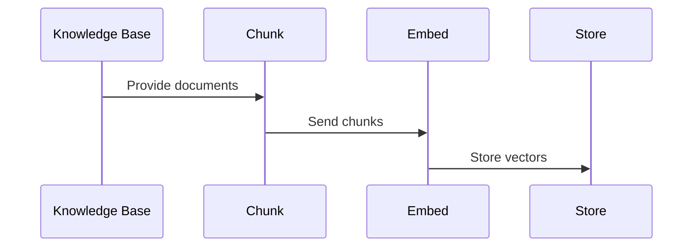
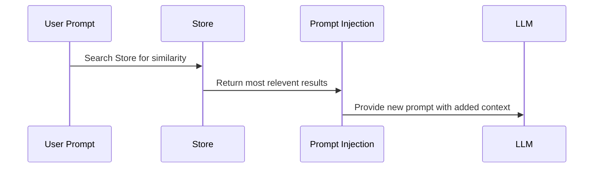

# What is RAG?

Similar to how LLMs can become more powerful when equipped with tools they can use to take actions, we can also boost their performance by providing relevant information alongside the prompts we give them.

Ever wished your AI agent could know about other files in your coding project, company policies, or the latest updates in your knowledge base? Thats exactly what RAG does!

RAG stands for Retrieval-Augmented Generation. At it's core, is a method that combines a large language model’s ability to generate text with an external source of knowledge. Instead of relying only on what the model learned during training, RAG allows it to “look things up” in a database, knowledge base, or document collection. It can then use that information to produce more accurate, relevant, and up-to-date answers.

## Why Should You Care About RAG?

LLMs are smart, but they have some pretty big limitations:

- **No access to your private data** (company docs, internal policies, recent updates)
- **Knowledge cutoff dates**: They miss recent information
- **Hallucinations** when they confidently make up facts

# How RAG Works?

When people talk about using RAG (Retrieval-Augmented Generation), they mean a system that can pull in relevant information from a knowledge base and inject it into an LLM’s prompt, so the model can generate responses that are more accurate and context-aware.

The process often looks like this:

1. **Chunk**  
   Split each document into manageable text chunks.

2. **Embed**  
   Convert each chunk to a vector using an embedding model.

3. **Store**  
   Write vectors and associated text/metadata to a vector store.

4. **Search**  
   At query time, embed the question and perform a similarity search to retrieve relevant chunks of information.

5. **Compose Prompt**  
   Join retrieved snippets into a context string and pass it to an LLM for a more informed answer.

# What It Looks Like?

### Creating a RAG Knowledge Base

### Using Your RAG

!!! tip "When RAG Shines"
    RAG is perfect when you need:

    - **Grounded answers** from internal docs, policies, FAQs, or knowledge bases
    - **Real-time accuracy** with frequently changing information
    - **Source traceability** to show exactly where answers come from
    - **Smart retrieval** when your knowledge base is too large for prompts

!!! warning "When RAG Might Be Overkill"
    Skip RAG if:

    - You only need general world knowledge your model already has
    - Your entire knowledge base easily fits in a single prompt
    - You're doing creative writing rather than fact-based responses

# Conclusion

On their own, LLMs are powerful but limited—they can “hallucinate” or produce outdated answers. By pairing them with retrieval, you effectively give your model a live knowledge companion. The LLM becomes the brain, while the retrieval system acts as the memory it can query when it needs help.