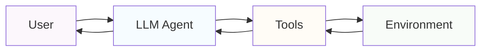

# What is an Agent?

The news around AI terms can be pretty overwhelming and sound more like a buzzword than something useful. Before we dive
deep into how you can build agents in **Railtracks**, let's first understand what an agent is.

An agent is a self-contained unit that can perform a specific task or set of tasks autonomously. It has the ability to
make decisions, take actions, and act within its environment to achieve its goals.

The key abilities of the agent include:

* **Autonomy**: Agents can operate independently within the boundaries you define
* **Adaptability**: Agents can adjust their behavior based on the environment and the tasks at hand
* **Goal-Oriented**: Agents are designed to achieve specific objectives or complete tasks
* **Interaction**: Agents can communicate with other agents or systems to gather information or perform actions
* **Stateful**: Agents maintain context and history and use it to inform their decisions

# LLMs as Agents

Reinforcement Learning and other AI techniques have trained specific agents to operate in their environments
for a while now, but LLMs have changed the game and made it much easier to use their generalized intelligence to
accomplish complex tasks and goals. This ability makes them uniquely suited to operate as the **brain** for your agentic
system.

# Real World Applications

Agents are already being used in real world applications such as:

1. Vibe Coding Tools ([Cursor](https://cursor.so/), [Windsurf](https://windsurf.com/), etc.)
2. NPC Interactions in Games ([AI Village](https://arxiv.org/pdf/2304.03442))
3. Technical Documentation Writing ([ParagraphAI](https://www.paragraphai.com/product))
4. Deep Research Tools ([GPT Deep Research](https://openai.com/index/introducing-deep-research/))

## Related Topics

* [Tools](tools.md)

## Build Your Own

We have build **Railtracks** with developers in mind; with just a simple prompt and a bit of Python, you’re
already well on your way to building your first agent. Get started [Building with Railtracks](../tutorials/byfa.md)

