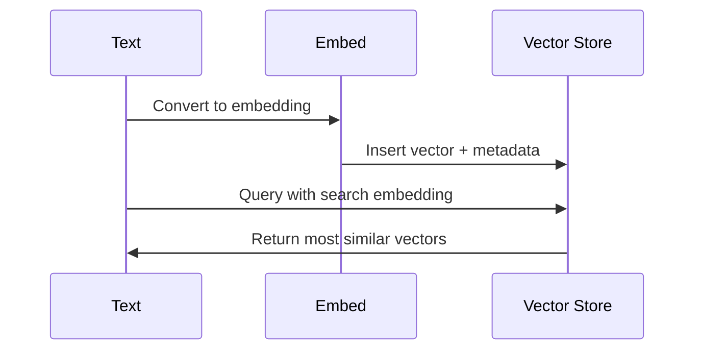

# Vector Stores in Railtracks

Vector stores are specialized databases that enable fast, semantic search across your documents. They let your AI agents efficiently find and retrieve relevant information based on meaning rather than exact keyword matches.

---

## What Is a Vector Store?

A vector store is a specialized database designed to store and search **embeddings** — numerical representations of text, code, or other content that capture semantic meaning.

Whenever you insert a document into a vector store, it goes through:

1. **Chunking** — Breaking content into manageable pieces  
2. **Embedding** — Converting chunks into numerical vectors  
3. **Storing** — Indexing vectors for efficient retrieval  

The vector store handles that last step, creating an index optimized for similarity search.

### Why Vector Stores Matter

Traditional databases search for exact matches. Vector stores search by **semantic similarity**:

- They **index** high-dimensional vector representations  
- They **search** using distance metrics (cosine similarity, euclidean distance, etc.)  
- They return **ranked results** based on how close vectors are in embedding space  

This enables semantic search, recommendation systems, and retrieval workflows like RAG.

---

## How Vector Stores Work (Conceptually)

### Key Operations

- **Insert**: Add vectors with optional metadata (IDs, text, tags)
- **Query**: Find nearest neighbors to a query vector
- **Update**: Modify existing vectors or metadata
- **Delete**: Remove vectors from the index

---

## Common Use Cases

Vector stores power:

- **Semantic search** — Find documents by meaning, not keywords
- **Recommendation engines** — Suggest similar items or content
- **Retrieval-Augmented Generation (RAG)** — Provide relevant context to LLMs
- **Deduplication** — Identify similar or duplicate content
- **Classification** — Group content by semantic similarity