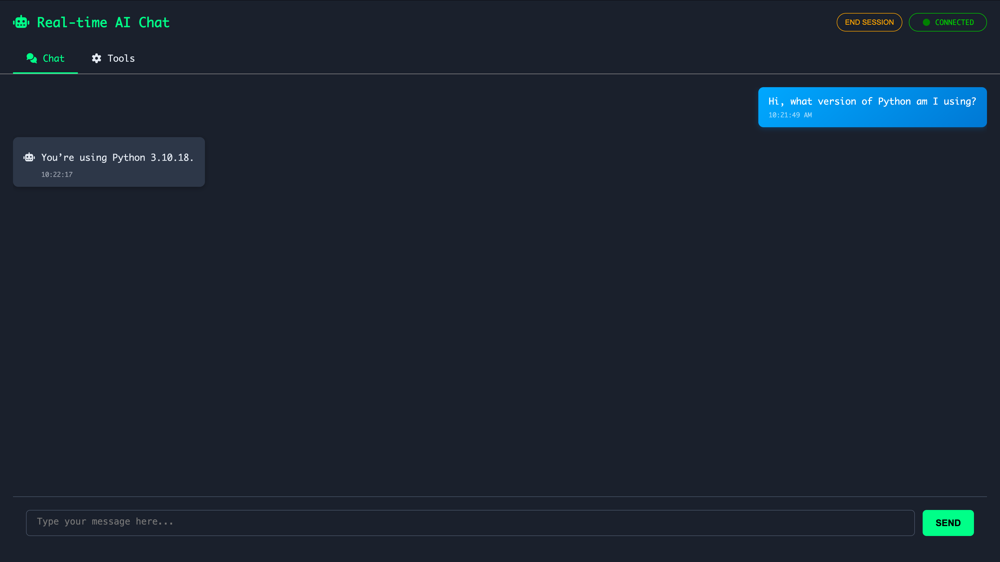
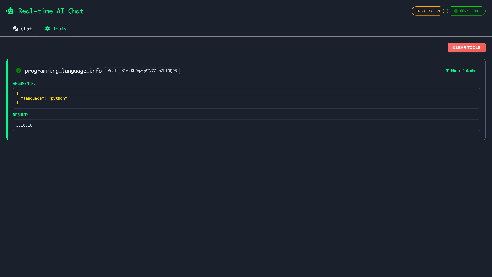
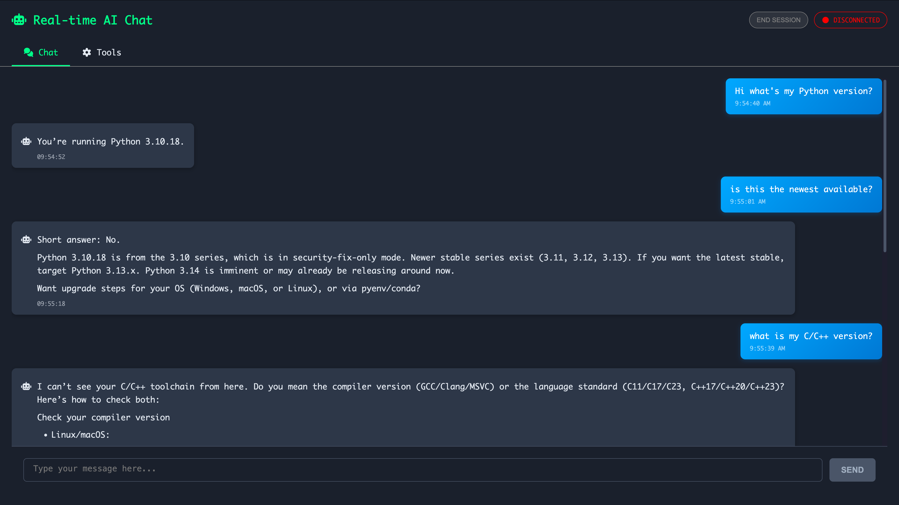

In this tutorial, we'll quickly cover how you can interact with any previous made agents in a multi-turn style chat.

## 1. `local_chat` from `interactive` module
Simply pass any of the agents you've made so far to the `local_chat` method as follows:
```python
--8<-- "docs/scripts/chatui.py:interactive"
```
and you will see automatically a window pop open in your browser with the following style:

Additionally, you can also view the tool invocations that happened throughout your conversation:

After you are finished with talking interactive with the model, you can press **`END SESSION`** and the rest of your workflow will continue to execute.

The possibilities from here on are endless. For instance you can replace the `llm` parameter with a locally running `Ollama` model and have your own locally run agent that you can chat with at your leisure! Give it tools to empower it even more.

???+ warning "Streaming"
    Currently for the local chat streaming LLM responses is not supported.

## 2. Customizing the UI

If you would like to customize the appearance of the UI, we have provided the relevant css file for you to modify at [chat.css](https://github.com/RailtownAI/railtracks/blob/main/packages/railtracks/src/railtracks/utils/visuals/browser/chat.css). The full html and javascript are also available within the same folder if you'd like to take things further.

## 3. Integrating Human In the Loop in your flow

You can expand the section below for a more involved example regarding a conversation analyzer agent and a customer service agent.


??? example "Human in the Loop Flow"
    In this example we'll have an agent analysis the conversation of another agent. You can imagine similar scenarios happening in customer support cases where you'd like to assess the helpfulness and/or issue resolution progress.

    Of course, this is meant as a simple local example and if you'd like to customize or deploy such behaviour you can take extend the `HIL` ([Human In the Loop](hil.md)) class.

    Once the person interacting presses **`END SESSION`** in the UI, the rest of the flow will proceed.
    ```python
    --8<-- "docs/scripts/chatui.py:advanced"
    ```
    Here's the conversation:
    
    And here's the output of the `AnalysisAgent`:
    ```
    Confirmed Python 3.10.18; not latest; guidance for C/C++ versions.
    ```
