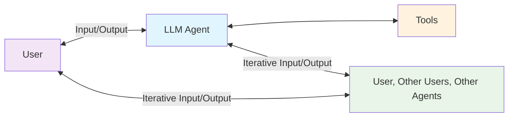

Quite often an agentic workflow needs further input from a human user (or another agent) in a muli-turn style conversation or verification.

Revisiting the figure from the background on [agents](../background/agents.md), we can take a new view:

To allow this for the users of the framework, we have designed an extendible abstract class called `HIL` (*Human In the Loop*). Additionally we have implemented a local chat server for quick development and prototyping of such behaviours. Please refer to the following sections for futher information:

* [Local ChatUI](local_chat_ui.md)
* [Custom HIL Behaviour](hil.md)