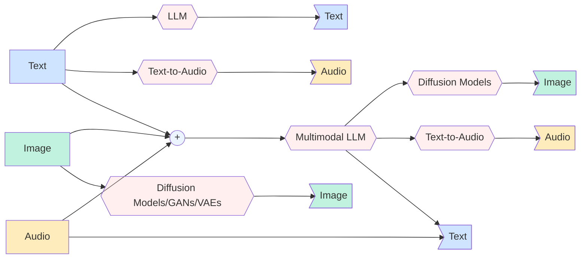

Traditionally, LLMs map text input to text output. Newer multimodal foundation models can accept additional modalities such as images and, in some cases, audio.

There are also many scenarios where you generate non‑text outputs from text prompts (images or speech) using diffusion models or Text-to-Speech (TTS) models. Below is an illustration of the input/output permutations across the three common modalities. This is by no means a comprehensive coverage on all of the different pathways possible but should serve to illustrate the overall pattern.

As you can imagine, covering all of these different paths while maintaining a relatively flexbile and developer friendly public API for any framework would be challening. Therefore, currently for the agents built using our framework we support **text** and **vision** for input and **only text** as output. This won't prevent users from having an image generation model wrapped inside a **`Tool`** and giving the agent access to this.

If you would like to see other modalities supported on either input or output side of the equation, we'd welcome your contributions or discussions for such feature requests.