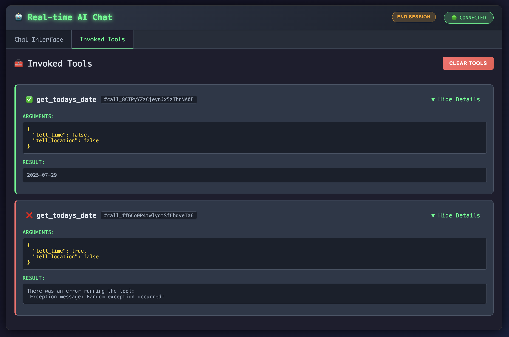

## Overview
Conversational interactions with agents is currently one of the most common methods. This guide will go over how to quickly visualize and come up with a proof of concept assessing how the potential user experience would look using `RailTracks`.

```python
import random
import datetime

import railtracks as rt
from railtracks.nodes.library.easy_usage_wrappers.chat_tool_call_llm import chat_tool_call_llm

def get_todays_date(tell_time: bool, tell_location: bool):
    """
    Returns the correct date once called. Time can also be provided.

    Args:
        tell_time (bool): if set to True will also return time
    """

    if tell_location:
        raise ValueError("Location is not supported in this example.")

    if tell_time:
        if random.random() < 0.8:
            raise RuntimeError("Random exception occurred!")
        return str(datetime.datetime.now())
    else:
        return str(datetime.date.today())

INSTRUCTION ="""
You are a helpful agent that can analyze images and answer questions about them.
"""

ChatBot = chat_tool_call_llm(
    port=5000,
    auto_open=True,
    llm_model=rt.llm.OpenAILLM("gpt-4o"),
    pretty_name="ChatBot",
    system_message=rt.llm.SystemMessage(
        INSTRUCTION
    ),
    connected_nodes={
        get_todays_date,
    },
)

with rt.Runner(rt.ExecutorConfig(timeout=600)) as runner:
    resp = runner.run_sync(
        ChatBot,
        rt.llm.MessageHistory(),
    )
```

## Walkthrough
The above code defines a simple tool that provides the agent with either date or datetime together and randomly throws a bug. This is done on purpose to demonstrate the tool view and illustration of different invocation outcomes.

By using the INSERT NAME here, you can easily do this. Upon running the above code, the following window will open:


Here you can see the conversation history with the agent markdown formatted. Additionally, you can also use the `Invoked Tools` tab to visualize the input/output of the tools the agent has used.



While this is meant to be used locally, the styling of the UI can be adjusted by changing the files `chat.css` and `chat.html`.