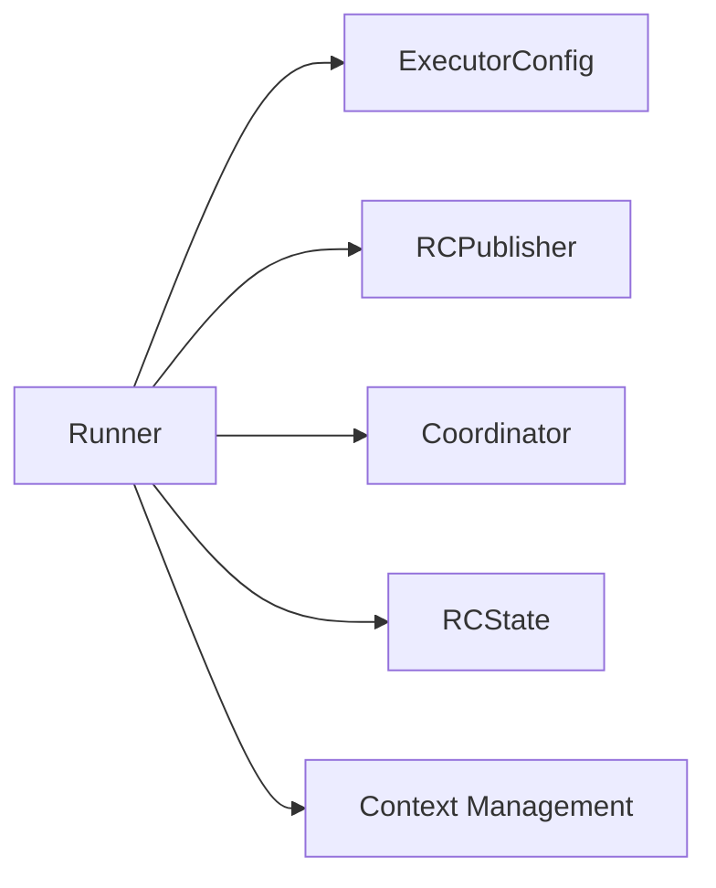
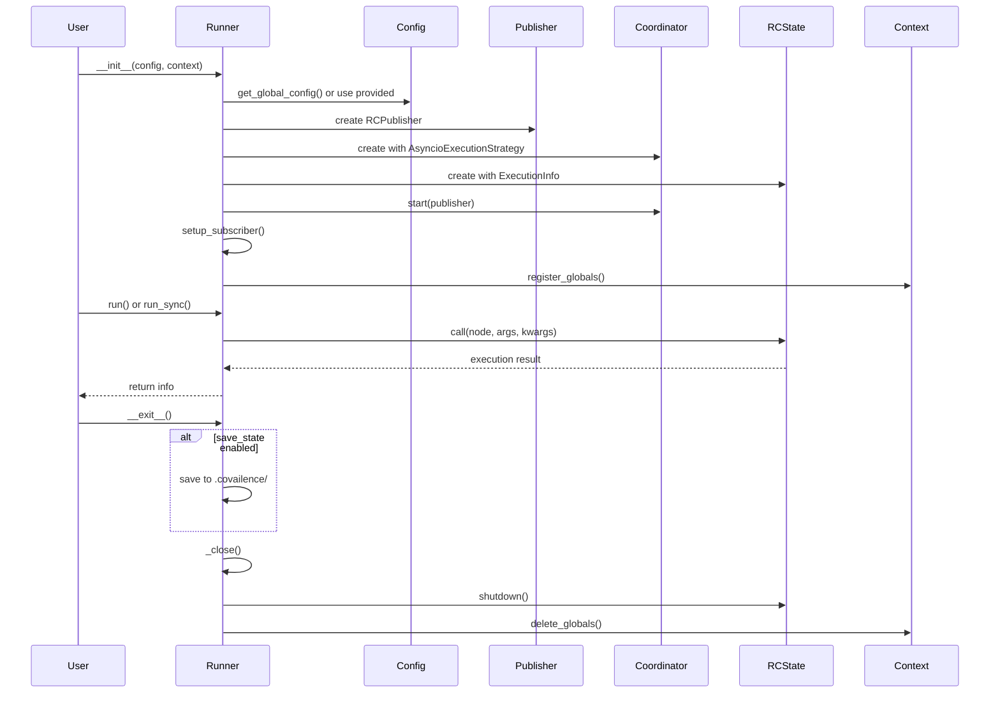

# Runner

The `Runner` class serves as the **primary orchestrator** and **entry point** for executing workflows in the Request Completion framework. It acts as a context manager that coordinates the lifecycle of execution, manages system resources, and provides both synchronous and asynchronous execution interfaces.

## Architecture Overview

The Runner implements a sophisticated orchestration pattern that coordinates multiple subsystems:



## Core Components

### 1. ExecutorConfig
The configuration backbone that controls:

- **Logging**: Level settings (`VERBOSE`, `REGULAR`, `QUIET`, `NONE`) and file output
- **Execution Behavior**: Timeout settings, error handling (`end_on_error`)
- **State Management**: Persistence settings (`save_state`) and run identification
- **Streaming**: Subscriber configuration for real-time message handling
- **Security**: Prompt injection controls

### 2. RCPublisher & PubSub System
- **Message Broadcasting**: Publishes execution events throughout the system
- **Subscriber Management**: Handles streaming subscribers for real-time monitoring
- **Event Coordination**: Facilitates communication between system components

### 3. Coordinator & Execution Strategy
- **Strategy Pattern**: Currently supports `AsyncioExecutionStrategy` with extensibility for future execution modes
- **Resource Management**: Handles concurrent execution and resource allocation
- **Task Coordination**: Manages the execution pipeline and task scheduling

### 4. RCState
- **Execution Orchestration**: Central state management for all running nodes
- **Result Tracking**: Maintains execution history and results
- **Error Handling**: Processes failures and manages recovery strategies

### 5. Context Management
- **Global Registration**: Registers runtime context variables and configuration
- **Resource Cleanup**: Ensures proper cleanup of resources and global state
- **Lifecycle Management**: Handles initialization and teardown processes

## Execution Flow



## Usage Patterns

### Basic Synchronous Execution

```python
import requestcompletion as rc

with rc.Session() as runner:
    result = runner.run_sync(MyNode)
    print(result.answer)
```

### Asynchronous Execution

```python
import requestcompletion as rc


async def main():
    with rc.Session() as runner:
        result = await runner.run(MyNode)
        return result.answer
```

### Custom Configuration

```python
import railtracks as rt

config = rt.ExecutorConfig(
    logging_setting="VERBOSE",
    save_state=True,
    end_on_error=True,
    timeout=30.0
)

with rt.Session(executor_config=config) as runner:
    result = await rt.call(MyNode)
```

## State Persistence

When `save_state=True`, the Runner automatically saves execution information to `.covailence/{run_identifier}.json`, providing:
- **Execution Graph**: Complete visualization of node execution flow
- **Performance Metrics**: Timing and resource usage statistics
- **Debug Information**: Detailed execution traces for troubleshooting

## Resource Management

The Runner implements proper resource management through:

1. **Context Manager Protocol**: Automatic cleanup via `__enter__` and `__exit__`
2. **Global Context Registration**: Centralized management of runtime variables
3. **Publisher Lifecycle**: Proper shutdown of message publishing system
4. **Logging Cleanup**: Detachment of logging handlers to prevent resource leaks

## Extension Points

### Custom Execution Strategies
The Coordinator can be extended with additional execution strategies:
```python
# Future extensibility
coordinator = Coordinator(
    execution_modes={
        "async": AsyncioExecutionStrategy(),
        "threaded": ThreadedExecutionStrategy(),  # Future
        "distributed": DistributedExecutionStrategy()  # Future
    }
)
```

### Streaming Subscribers
Real-time execution monitoring through custom subscribers:
```python
def my_subscriber(message: str):
    print(f"Execution update: {message}")

config = rc.ExecutorConfig(subscriber=my_subscriber)
```

## Key Design Principles

1. **Single Responsibility**: Each component has a clear, focused purpose
2. **Dependency Injection**: Components are injected rather than created internally
3. **Resource Safety**: Proper cleanup and resource management
4. **Extensibility**: Plugin architecture for future enhancements
5. **Observability**: Comprehensive logging and state tracking

The Runner serves as the **foundation** of the Request Completion framework, providing a robust, extensible platform for executing complex workflows while maintaining clean separation of concerns and proper resource management.