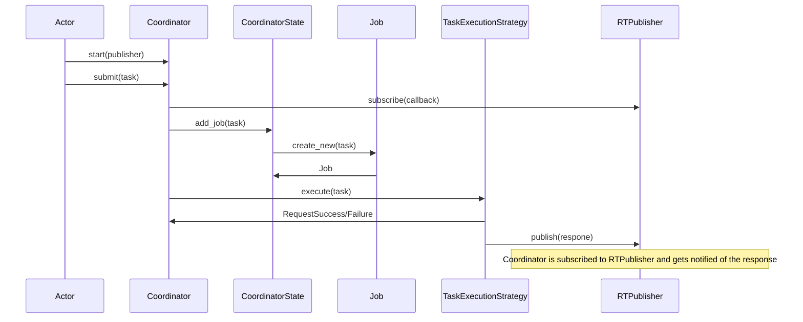

# 🎯 Coordinator

<link rel="stylesheet" href="/system_internals/css/class_diagram.css">
<script src="/system_internals/js/class_diagram.js"></script>

## 🌟 Overview

The `Coordinator` is the central component responsible for invoking and managing the execution of tasks within the Railtracks system. It acts as the concrete invoker, receiving tasks and delegating them to the appropriate execution strategies. It ensures that every task is tracked from submission to completion, maintaining a comprehensive state of all ongoing and completed jobs.

## 🔧 Key Components

### 🎮 `Coordinator`

This class orchestrates task execution. It maintains the system's state via `CoordinatorState`, uses different `AsyncioExecutionStrategy` implementations to run tasks, and listens for task completion events through the pub/sub system to keep the state up-to-date.

<div class="class-diagram" id="coordinator-diagram" data-diagram='{
  "classes": [
    {
      "id": "coordinator",
      "name": "Coordinator",
      "attributes": [
        {"name": "state", "type": "CoordinatorState", "visibility": "public"},
        {"name": "execution_strategy", "type": "Dict[ExecutionConfigurations, TaskExecutionStrategy]", "visibility": "public"}
      ],
      "methods": [
        {"name": "__init__", "parameters": "execution_modes: Dict[ExecutionConfigurations, TaskExecutionStrategy]", "visibility": "public"},
        {"name": "start", "parameters": "publisher: RTPublisher", "visibility": "public"},
        {"name": "handle_item", "parameters": "item: RequestCompletionMessage", "visibility": "public"},
        {"name": "submit", "parameters": "task: Task, mode: ExecutionConfigurations", "visibility": "public"},
        {"name": "system_detail", "returnType": "CoordinatorState", "visibility": "public"},
        {"name": "shutdown", "visibility": "public"}
      ]
    }
  ]
}'></div>
### 📊 `CoordinatorState`

A state container that holds a list of all `Job` objects. It tracks every task that is currently running or has been completed, providing a complete history of work handled by the `Coordinator`.

<div class="class-diagram" id="coordinator-state-diagram" data-diagram='{
  "classes": [
    {
      "id": "coordinator-state",
      "name": "CoordinatorState",
      "attributes": [
        {"name": "job_list", "type": "List[Job]", "visibility": "public"}
      ],
      "methods": [
        {"name": "__init__", "parameters": "job_list: List[Job]", "visibility": "public"},
        {"name": "empty", "returnType": "CoordinatorState", "visibility": "public"},
        {"name": "add_job", "parameters": "task: Task", "returnType": "void", "visibility": "public"},
        {"name": "end_job", "parameters": "request_id: str, result: Literal", "returnType": "void", "visibility": "public"},
        {"name": "__str__", "returnType": "str", "visibility": "public"}
      ]
    }
  ]
}'></div>
### 📝 `Job`

Represents a single unit of work. A `Job` is created when a task is submitted, and its lifecycle is tracked from an `opened` to a `closed` state. It records the task's identifiers, status, result, and timing information, offering a detailed view of each task's execution.

<div class="class-diagram" id="job-diagram" data-diagram='{
  "classes": [
    {
      "id": "job",
      "name": "Job",
      "attributes": [
        {"name": "request_id", "type": "str", "visibility": "public"},
        {"name": "parent_node_id", "type": "str", "visibility": "public"},
        {"name": "child_node_id", "type": "str", "visibility": "public"},
        {"name": "status", "type": "Literal[\"opened\", \"closed\"]", "visibility": "public"},
        {"name": "result", "type": "Literal[\"success\", \"failure\"] | None", "visibility": "public"},
        {"name": "start_time", "type": "float", "visibility": "public"},
        {"name": "end_time", "type": "float", "visibility": "public"}
      ],
      "methods": [
        {"name": "__init__", "parameters": "request_id, parent_node_id, child_node_id, status, result, start_time, end_time", "visibility": "public"},
        {"name": "create_new", "parameters": "task: Task", "returnType": "Job", "visibility": "public"},
        {"name": "end_job", "parameters": "result: Literal", "returnType": "void", "visibility": "public"},
        {"name": "__str__", "returnType": "str", "visibility": "public"},
        {"name": "__repr__", "returnType": "str", "visibility": "public"}
      ]
    }
  ]
}'></div>

### ⚡ `AsyncioExecutionStrategy`

An execution strategy that uses asyncio for task execution. This strategy provides async-await style execution for tasks, allowing for efficient concurrent processing without the need for threads or processes. It handles task invocation, result processing, and error handling while publishing completion messages through the pub/sub system.

<div class="class-diagram" id="asyncio-execution-strategy-diagram" data-diagram='{
  "classes": [
    {
      "id": "asyncio-execution-strategy",
      "name": "AsyncioExecutionStrategy",
      "methods": [
        {"name": "shutdown", "returnType": "void", "visibility": "public"},
        {"name": "execute", "parameters": "task: Task", "returnType": "RequestSuccess | RequestFailure", "visibility": "public"}
      ]
    }
  ]
}'></div>

<!-- ```mermaid
classDiagram
    class Coordinator {
        +state: CoordinatorState
        +execution_strategy: Dict[ExecutionConfigurations, TaskExecutionStrategy]
        +submit(task: Task)
        +handle_item(message: RequestCompletionMessage)
    }
    
    class CoordinatorState {
        +job_list: List[Job]
        +add_job(job: Job)
        +end_job(request_id: str, result: str)
        +find_job(request_id: str) Job
    }
    
    class Job {
        +request_id: str
        +task_id: str
        +status: str
        +result: str
        +start_time: float
        +end_time: float
        +error_message: str
        +create_new(task: Task) Job
        +end_job(result: str)
        +set_error(error: str)
    }

    Coordinator "1" *-- "1" CoordinatorState : contains
    CoordinatorState "1" *-- "0..*" Job : manages
``` -->
## 🔄 Execution Flow

The execution of a task follows a well-defined sequence of events, ensuring reliable processing and state management:

1.  **Submission**: A task is submitted to the system via a call to `Coordinator.submit(task, mode)` where `mode` is the key for which `TaskExecutionStrategy` to be used.
2.  **Job Creation**: The `Coordinator` uses its member `CoordinatorState` object's `add_job` method which creates a `Job` instance for the submitted `Task` initialized with a status of `opened` and a start time.
3.  **Delegation**: The `Coordinator` determines the correct `TaskExecutionStrategy` based on the task's configuration and delegates the execution to it.
4.  **Asynchronous Execution**: The execution strategy runs the task asynchronously, allowing the `Coordinator` to manage other tasks concurrently.
5.  **Completion Notification**: Upon completion, the `TaskExecutionStrategy` publishes a `RequestCompletionMessage` to the pub/sub system.
6.  **Handling Completion**: The `Coordinator`, being a subscriber to these messages, receives the notification in its `handle_item` method.
7.  **Finalizing the Job**: The `Coordinator` finds the corresponding `Job` in its `CoordinatorState` using the `request_id` from the message and updates its status to `closed`, recording the final result and end time.

## 📊 Diagrams

This diagram shows the sequence of interactions when a task is submitted and processed.


**Note**: The Coordinator is subscribed to RTPublisher and gets notified of the response automatically through the pub/sub system.
