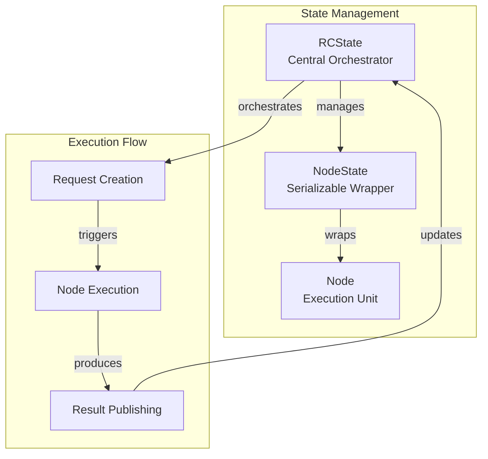
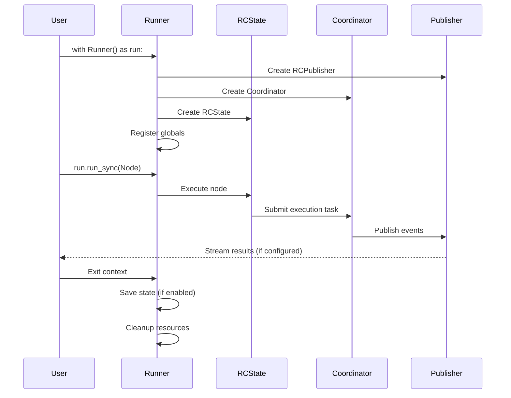
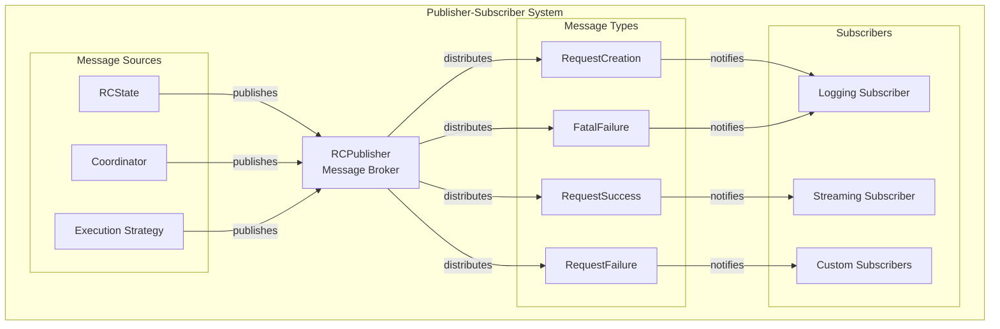
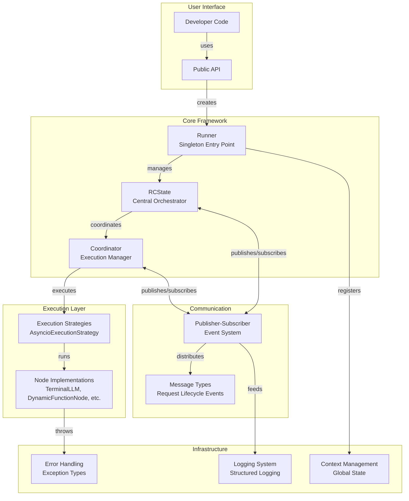

# **Request Completion** - Systematic Overview

This document provides an overview of the backend architecture of **Request Completion**, our framework for handling agentic workflows.


### RCState

`RCState` is the central state management class that orchestrates the entire execution flow:

```python
class RCState:
    """
    RCState manages state of the request completion system with these functions:
    1. Create new state objects for each execution run
    2. Invoke the graph at a given node and handle execution
    3. Handle all exceptions during graph execution
    4. Manage request creation and node state
    5. Save execution details for later access
    6. Provide logging of completed actions
    """
```

**Key responsibilities:**

- **Request Management**: Creates and tracks execution requests with unique IDs
- **Node Execution**: Coordinates the execution of nodes through the coordinator
- **Exception Handling**: Catches and processes `NodeInvocationError` and `FatalError` exceptions
- **State Persistence**: Maintains execution history and node states
- **Message Publishing**: Publishes execution events to the pub-sub system

### State Relationship Diagram



### Raw Notes
- subscribers to `self.handle` with the name `State Object Handler`
- `shutdown` shuts down the rc_coordinator object
- `is_empty` checks that we have nodes and requests(?)
- `add_stamp` stamps? Why do we need this?
- `cancel` cancels a node if it exists, if it doesn't, raises an AssertionError

## Runner

The `Runner` class is the main entry point for executing workflows in **Request Completion**. It implements a singleton pattern and provides both synchronous and asynchronous execution capabilities.

### Example Usage

#### Synchronous
```python
import requestcompletion as rc

with rc.Runner() as runner:
    result = runner.run_sync(SomeNode)
```
#### Asynchronous
```python
import requestcompletion as rc

with rc.Runner() as runner:
    result = await runner.run(SomeNode)
```

### Key Components

The Runner orchestrates several critical components:

- **ExecutorConfig**: Configuration for logging, state saving, and execution behavior
- **RCPublisher**: Handles message publishing for the pub-sub system
- **Coordinator**: Manages different execution strategies (async, etc.)
- **RCState**: Central state management and execution orchestration
- **Context Management**: Global variable registration and cleanup

### Execution Flow

1. **Initialization**: Sets up logging, creates publisher, coordinator, and state objects
2. **Context Registration**: Registers global context variables and configuration
3. **Execution**: Delegates to `RCState` for actual node execution
4. **State Persistence**: Optionally saves execution state to `.covailence` directory
5. **Cleanup**: Properly closes resources and deregisters global context

### Execution Strategies

The Runner supports multiple execution strategies through the `Coordinator`:

- **AsyncioExecutionStrategy**: Default async execution using asyncio
- **Future Strategies**: Framework designed to support additional execution modes

### Raw Notes

- creates an `RCState` -> Need to understand what this is
- starts the coordinator by passing in `publisher` ? -> Look into the `start` method of coordinator
- setups its subscriber? -> What message types does it subscribe to?
- `exit` 
    - Saves the json file for the run if required
    - calls `close`
        - What does `close` do?
            - calls `shutdown` on `RCState` object
            - detaches loggers -> Helper function
            - deletes globals -> Helper function

- `run` and `run_sync` methods
    - both run `call` method and return `info` from `RCState`
    - `run` awaits `call` and `run_sync` uses `asyncio.run` to run it synchronously

- `call`
    - awaits `call` -> note that function called `self.call` awaits `call`
    - `call` is beyond the scope of runner -> we can just call abstraction of it calls the TopLevelNode passed to it


- `setup_subscriber`
    - Need further clairty, come back after reviewing PubSub


### Runner Lifecycle Diagram



## Publisher-Subscriber Model

**Maistro** uses a robust pub-sub system for real-time communication between components, enabling streaming execution results, logging, and monitoring.

### Core Components

#### Publisher

The `RCPublisher` is a generic publisher that manages subscribers and message distribution:

```python
class Publisher(Generic[_T]):
    """
    A simple publisher with basic functionality to publish and subscribe to messages.
    
    Features:
    - Messages handled in order (FIFO)
    - Dynamic subscriber registration during operation
    - Async and sync callback support
    """
```

#### Subscribers

Subscribers are wrapper classes around callback functions:

```python
class Subscriber(Generic[_T]):
    """A simple wrapper class of a callback function."""
    
    def __init__(self, callback: Callable[[_T], None] | Callable[[_T], Coroutine[None, None, None]], name: str | None = None):
        self.callback = callback
        self.name = name
        self.id = str(uuid.uuid4())
```

### Message Types

The framework defines several message types for different execution events:

#### Request Lifecycle Messages

```python
# Base class for all RC messages
class RequestCompletionMessage(ABC):
    """The base class for all messages on the request completion system."""

# Request creation and execution
class RequestCreation(RequestCompletionMessage): 
    """Published when a new request is created"""

class RequestSuccess(RequestFinishedBase):
    """Published when a request completes successfully"""

class RequestFailure(RequestFinishedBase):
    """Published when a request fails with recoverable error"""

class FatalFailure(RequestFinishedBase):
    """Published when a request fails with unrecoverable error"""
```

### Message Flow

The pub-sub system enables several key workflows:

1. **Execution Monitoring**: Track request creation, progress, and completion
2. **Error Handling**: Broadcast failures for logging and recovery
3. **Streaming Results**: Real-time result streaming to external systems
4. **Debugging**: Detailed execution event logging

### Pub-Sub Architecture Diagram



## Execution Coordination

The `Coordinator` manages different execution strategies and handles the actual running of nodes within the framework.

### Coordinator Architecture

```python
class Coordinator:
    """
    Manages execution strategies and coordinates node execution across different modes.
    """
    
    def __init__(self, execution_modes: dict[str, ExecutionStrategy]):
        self.execution_modes = execution_modes  # e.g., {"async": AsyncioExecutionStrategy()}
```

### Execution Strategies

#### AsyncioExecutionStrategy

The default execution strategy uses asyncio for concurrent node execution:

- **Task Management**: Creates and manages asyncio tasks for node execution
- **Error Handling**: Catches exceptions and publishes appropriate failure messages
- **Result Publishing**: Publishes success messages with node results
- **Concurrency**: Enables multiple nodes to execute concurrently

### Task Execution Flow

1. **Task Creation**: `RCState` creates execution tasks with unique request IDs
2. **Strategy Selection**: Coordinator selects appropriate execution strategy
3. **Node Execution**: Strategy executes node's `tracked_invoke()` method
4. **Result Handling**: Success/failure messages published to pub-sub system
5. **State Updates**: Node states and results stored in `RCState`

## Error Handling and Exceptions

**Maistro** provides comprehensive error handling with specific exception types for different failure scenarios.

### Exception Hierarchy

```python
# Core framework exceptions
class NodeInvocationError(Exception):
    """Recoverable errors during node execution"""

class FatalError(Exception): 
    """Unrecoverable errors that halt execution"""

class NodeCreationError(Exception):
    """Errors during node instantiation and validation"""

# Runner-specific exceptions  
class RunnerCreationError(Exception):
    """Errors when creating multiple runner instances"""

class RunnerNotFoundError(Exception):
    """Errors when no runner instance exists"""
```

### Error Recovery

- **NodeInvocationError**: Logged and propagated, allows workflow to continue
- **FatalError**: Triggers system shutdown and cleanup
- **Validation Errors**: Caught during node creation to prevent invalid configurations

## Context Management

**Maistro** provides global context management for sharing configuration and state across the execution environment.

### Global Context Features

- **Runner Identification**: Unique IDs for tracking multiple runner instances
- **Configuration Sharing**: Executor configuration accessible globally
- **Variable Persistence**: Custom context variables available throughout execution
- **Cleanup Management**: Automatic context cleanup on runner exit

### Context Lifecycle

```python
# Registration during runner startup
register_globals(
    runner_id=self._identifier,
    rc_publisher=self.publisher, 
    parent_id=None,
    executor_config=executor_config,
    global_context_vars=context,
)

# Cleanup during runner shutdown
delete_globals()
```

## Framework Architecture Overview

The following diagram shows how all components work together in **Maistro**:

