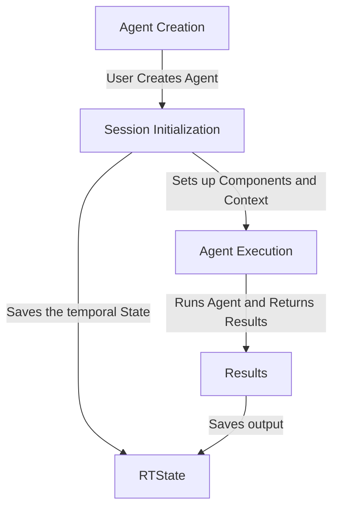

# RailTracks Internal Architecture Overview

Welcome to the internal architecture overview of RailTracks, our framework for building agentic workflows. This document provides a high-level understanding of how the system is structured and how its different components interact with each other.

## Execution Flow

1. **Agent Creation**: Users create an agent using `rt.agent_node(...)` customizing the various different available parameters such as `llm_model`, `system_message`, and `tool_nodes`. 
2. **Session Initialization**: The `Session` is initialized as a context manager, which sets up the necessary components like `RTPublisher`, `Coordinator`, and `RTState`.
3. **Agent Execution**: Users run the agent by calling `call` or `call_sync` methods inside the context with the appropriate parameters given the setup of their agent.

## Core Architectural Principles
- **Immutable State Trees**: All execution history preserved
- **Event-Driven Communication**: Pub/sub messaging between components  
- **Graceful Error Recovery**: Continue execution when possible and desirable
- **Session-Scoped Isolation**: Clean boundaries between workflow runs

## Developer Journey

1. **Start Here**: [Core Concepts](concepts.md) - Understand the mental model behind RailTracks
2. **Core Components**
    - [Session](session.md)
    - [PubSub System](pubsub.md)
    - [Coordinator](coordinator.md)
    - [RTState](rtstate.md)
