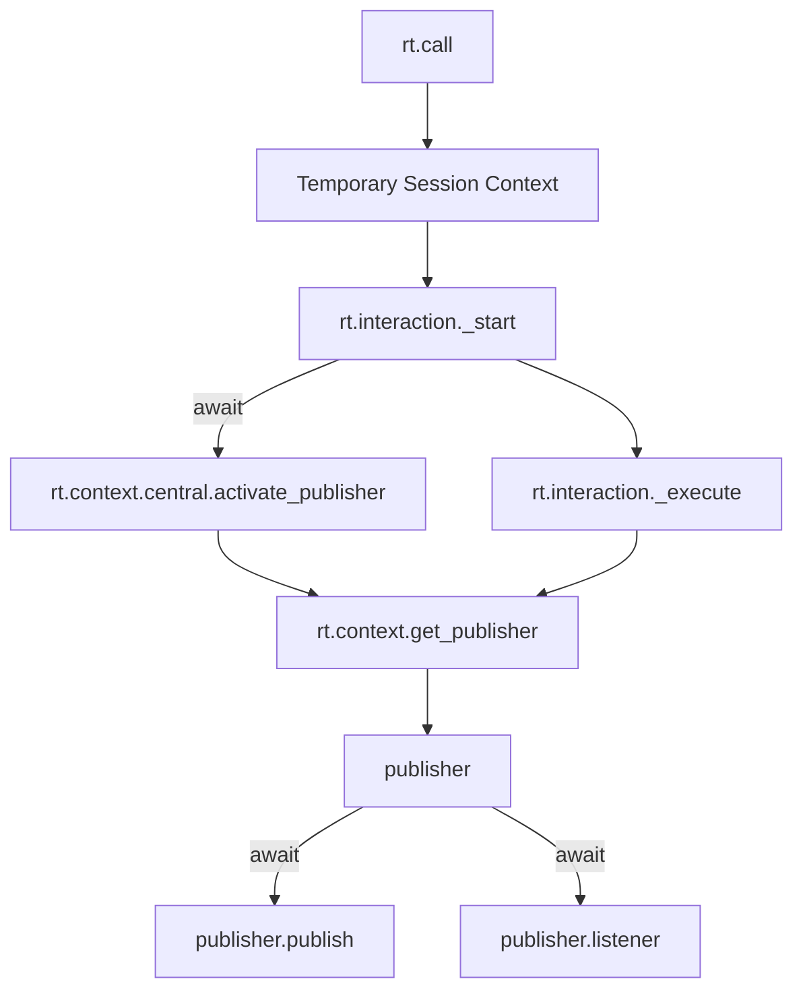

## Overview

**Nodes** are the main components of **RailTracks** core of our abstractions. Looking at the abstract class, we can see that each Node needs the following methods implemented:

## Execution Flow
After the creation of a Node, execution primarily happens through the `call` method, which is responsible for invoking the node's logic and handling its execution flow. The `call` method can be called synchronously or asynchronously, depending on the node's configuration and the execution strategy in use.

The scenario for the execution of a node is one of the following cases:

1. **Standalone Execution**

2. **Within a Session Context**

    a. **Top Level Node Execution**

    b. **Node Invoking Another Node**

## Standalone Execution
This is the simplest case where a node is executed independently, without being part of a larger workflow or session. This is mainly when we want to quickly test a node's functionality or when the node is designed to be used in isolation and we do not care about tracking its execution history or state.

Here is a breakdown of the flow:

1. **Call Invocation**: The process begins with the invocation of the `call` method on a node, which is the entry point for executing the node's logic.
2. **Session Context Wrapper**: Inside call, if we identify if no session context exists, we create a temporary session context wrapper to manage the execution environment.
3. **Start Interaction**: The `rt.interaction._start` function is called to firstly initalize the publisher and then execute the node's logic.
4. **Publisher Activation**: The publisher is activated to handle message publishing and subscribing.
5. **Node Execution**: The node's logic is executed within the `_execute` function, which handles the actual processing of the node.
5. **Node Execution**: The node's logic is executed within the `_execute` function, which publishes a `RequestCreation` message to signal the start of the node's execution and then "listens" for completion messages and returns the final result.
6. **Cleanup**: After execution, the publisher is shutdown and we exit the temporary session context.