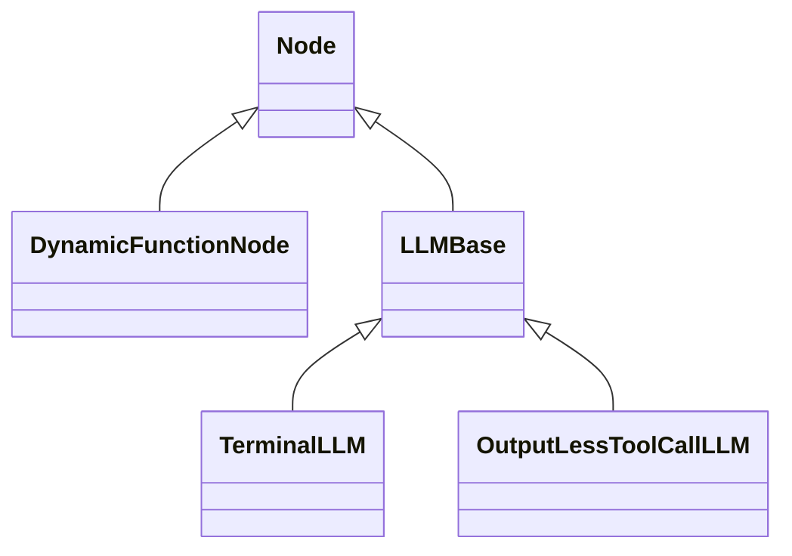

## Node Abstractions

**Nodes** are the main components of **Request Completion** and sit at the core of our abstractions. Looking at the abstract class, we can see that each Node needs the following methods implemented:

```python
@abstractmethod
def pretty_name(cls) -> str:
    """
    Returns a pretty name for the node. This name is used to identify the node type of the system.
    """
    pass

@abstractmethod
async def invoke(self) -> _TOutput:
    """
    The main method that runs when this node is called
    """
    pass
```

The `invoke` method is the most important method for any class inheriting from `Node`, as it provides the core functionality for the implemented Node. This is better illustrated by examining the current classes inheriting from `Node`.

### TerminalLLM

`TerminalLLM` is a class inherited from `LLMBase` (which itself is inherited from `Node`) that provides one-shot and tool-less interactions with an LLM provider. Let's take a look at its implementation of `invoke`:
```python
async def invoke(self) -> str | None:
    """Makes a call containing the inputted message and system prompt to the llm model and returns the response

    Returns:
        (TerminalLLM.Output): The response message from the llm model
    """
    try:
        returned_mess = await self.llm_model.achat(self.message_hist)
    except Exception as e:
        raise LLMError(
            reason=f"Exception during llm model chat: {str(e)}",
            message_history=self.message_hist,
        )

    self.message_hist.append(returned_mess.message)
    if returned_mess.message.role == "assistant":
        cont = returned_mess.message.content
        if cont is None:
            raise LLMError(
                reason="ModelLLM returned None content",
                message_history=self.message_hist,
            )
        return cont

    raise LLMError(
        reason="ModelLLM returned an unexpected message type.",
        message_history=self.message_hist,
    )

```

Looking at this code, it makes an asynchronous request to an LLM provider, appends the response content to the message history, and returns that content.

### DynamicFunctionNode

The `DynamicFunctionNode` handles automatic parsing of docstrings, parameters and their types, and invocations of any Python functions being wrapped as a Node type. Let's take a look at its `invoke` method:
```python
if inspect.iscoroutinefunction(func):

    async def invoke(self) -> _TOutput:
        """Invoke the function as a coroutine."""
        return await func(*self.args, **self.kwargs)

else:

    def invoke(self):
        result = func(*self.args, **self.kwargs)
        if asyncio.iscoroutine(result):
            # TODO: connect with item #91
            raise NodeCreationError(
                message="The function you provided was a coroutine in the clothing of a sync context. Please label it as an async function.",
                notes=[
                    "If your function returns a coroutine (e.g., calls async functions inside), refactor it to be async.",
                    "If you see this error unexpectedly, check if any library function you call is async.",
                ],
            )
        return result
```

Essentially, after parameter handling (which is beyond the scope of this guide), the framework runs the wrapped function using this Node.




### Node Lifecycle and Features

All nodes in **Maistro** have additional built-in capabilities:

- **Automatic Async Handling**: The framework automatically converts synchronous `invoke` methods to async using `asyncio.to_thread()`
- **Performance Tracking**: The `tracked_invoke()` method measures execution latency and stores it in `LatencyDetails`
- **Debug Information**: Each node maintains a `DebugDetails` dictionary for debugging and logging
- **State Serialization**: Nodes can be safely copied and serialized for cross-process communication
- **Tool Integration**: Nodes inherit from `ToolCallable`, enabling them to be used as tools in agent workflows

## State Management

**Maistro** employs a sophisticated state management system with two primary state objects that work together to manage execution flow and data persistence.

### NodeState

`NodeState` is a lightweight wrapper that enables nodes to be passed across process boundaries:

```python
class NodeState(Generic[_TNode]):
    """
    A stripped down representation of a Node which can be passed along the process barrier.
    """
    
    def __init__(self, node: _TNode):
        self.node = node
    
    def instantiate(self) -> _TNode:
        """
        Creates a pass by reference copy of the node in the state.
        """
        return self.node
```

This class is JSON-serializable and acts as a container for node instances when they need to be transferred between different execution contexts.
