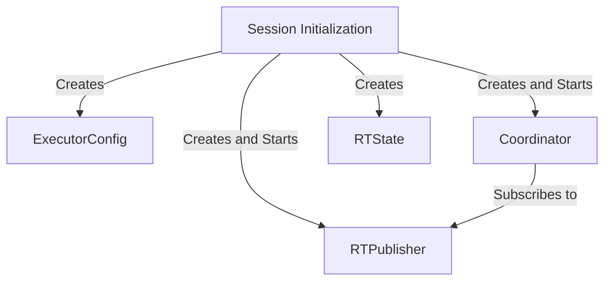
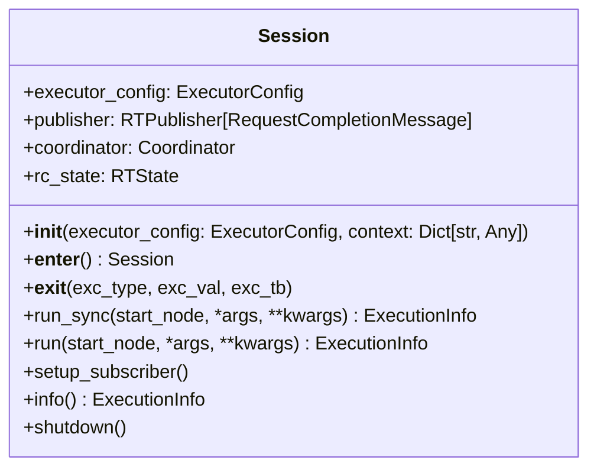
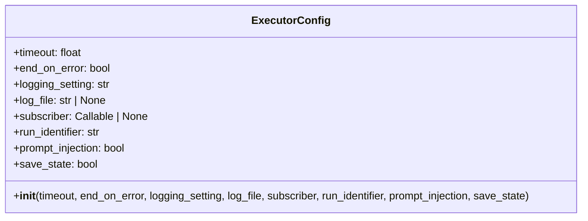
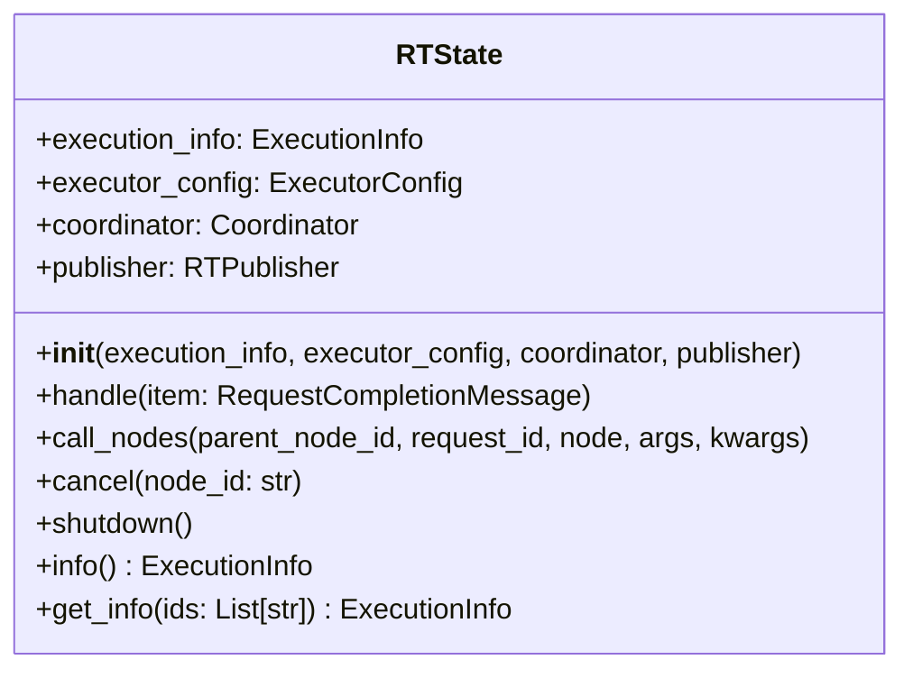
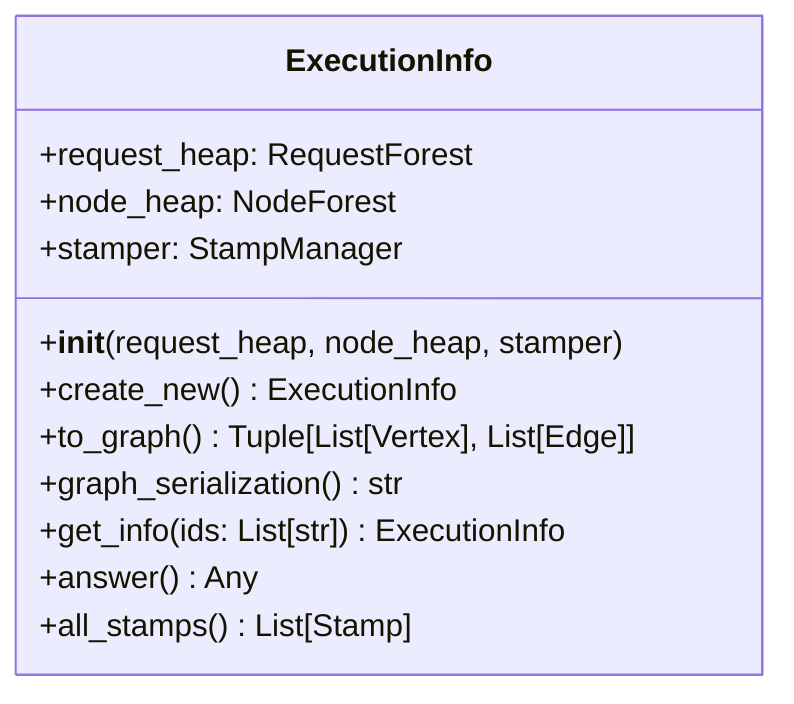

# Session

## Overview

The `Session` is the primary entry point and orchestrator for the entire Railtracks system. It serves as the main execution context that initializes, configures, and manages all core components required for running node-based workflows. The `Session` acts as a facade that brings together the `Coordinator`, `RTState`, `Pub/Sub` messaging, logging, and global context management into a unified, easy-to-use interface.

## Overall Flow

1. **Session Creation**: A new `Session` is created, initializing all necessary components.
2. **Context Management**: The `Session` manages the execution context, including variable scoping and state management.
3. **Workflow Execution**: Users define and execute workflows within the `Session`, leveraging its orchestration capabilities.
4. **Result Handling**: The `Session` collects and processes results from the workflow execution, providing a unified interface for accessing outcomes.
5. **Cleanup**: Upon completion, the `Session` handles cleanup tasks, ensuring all resources are released properly.

### Publisher/Subscriber Integration
The `Session` establishes a pub/sub messaging system where:
- `Coordinator` subscribes to handle task completion messages
- `RTState` subscribes to manage state updates
- Optional user subscribers can be attached for streaming

### Global Context Management
The `Session` manages global context through:
- Registration of session ID, publisher, and configuration
- Context variable scoping for nested executions
- Cleanup to prevent context leakage between runs

## Key Components

### `Session`

The main orchestrator class responsible for system initialization, lifecycle management, and providing both synchronous and asynchronous execution interfaces. It encapsulates all system components and manages their interactions through a well-defined lifecycle.

### `ExecutorConfig`

A configuration object that defines how the `Session` operates, including timeout settings, error handling behavior, logging configuration, and execution options. It provides comprehensive customization of the execution environment.

### `RTState`

The central state management component that tracks execution progress, manages node lifecycles, handles exceptions, and coordinates between different system components. It maintains the complete execution history and current system state.

### `ExecutionInfo`

A comprehensive data structure that captures the complete state of a run, including all nodes, requests, execution paths, timing information, and results. It provides both runtime access and post-execution analysis capabilities.

## Session Lifecycle

The `Session` follows a well-defined lifecycle that ensures proper initialization, execution, and cleanup:

### 1. Initialization Phase

During initialization, the `Session`:

- Creates or uses provided `ExecutorConfig`
- Initializes logging system based on configuration
- Creates `RTPublisher` for pub/sub messaging
- Instantiates `ExecutionInfo` for state tracking
- Creates `Coordinator` with execution strategies
- Initializes `RTState` to manage execution
- Registers global context variables
- Sets up subscriber connections

### 2. Execution Phase
During execution, the `Session`:

- Delegates node execution to the global `call` function
- Maintains execution state through `RTState`
- Coordinates task execution via `Coordinator`
- Publishes and handles completion messages via `RTPublisher`
- Tracks all execution details in `ExecutionInfo`

### 3. Cleanup Phase

During cleanup, the `Session`:

- Optionally saves execution state to disk (if `save_state=True`)
- Shuts down all execution strategies
- Detaches logging handlers
- Cleans up global context variables
- Releases system resources

## Configuration and Customization

The `Session` supports extensive customization through `ExecutorConfig`:

- **Timeout Control**: Set maximum execution time limits
- **Error Handling**: Configure whether to stop on first error or continue
- **Logging**: Control log levels and output destinations  
- **State Persistence**: Enable/disable saving execution state to disk
- **Streaming**: Attach custom subscribers for real-time monitoring
- **Context Injection**: Control global context variable behavior

## Error Handling and Recovery

The `Session` implements robust error handling:

- **Graceful Degradation**: Continues execution when possible
- **Error Propagation**: Properly bubbles up fatal errors
- **State Preservation**: Maintains execution state even during failures
- **Cleanup Guarantees**: Ensures proper resource cleanup in all scenarios