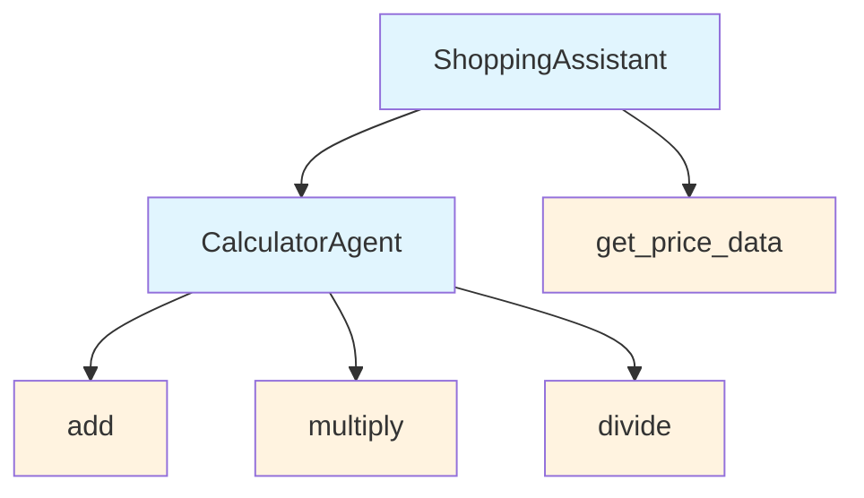

# Agents as Tools

In Railtracks, you can use any **Agent** as a tool that other agents can use. This allows you to create complex agents that can be composed of smaller, reusable components. 

!!! info "What are Nodes?"
    Nodes are the building blocks of Railtracks. They are responsible for executing a single task and returning a result. Read more about [**Nodes**](../../system_internals/node.md).

!!! info "How to build an Agent?"
    Read more about how to build an agent [**Build your First Agent**](../../tutorials/byfa.md).

## Understanding **`ToolManifest`**

Before diving into examples, it's important to understand what a **`ToolManifest`** is and why it's essential when creating agents that can be used as tools - it's a specification that describes how an agent should be used when called as a tool by other agents and defines:

- **`description`**: What the tool does and how it should be used
- **`parameters`**: What inputs the tool expects, including their names, types, and descriptions

!!! info "**`ToolManifest`**"
    For complete details on **`ToolManifest`**, see the [API Reference](../../api_reference/railtracks.html#ToolManifest).

!!! info "**`Parameter`**"
    For complete details on **`Parameter`**, see the [API Reference](../../api_reference/railtracks/llm.html#Parameter).

```python
--8<-- "docs/scripts/agents_as_tools.py:manifest"
```

The **`ToolManifest`** acts as a contract that tells other agents exactly how to interact with your agent when using it as a tool. Without it, other agents wouldn't know what parameters to pass or what to expect from your agent.

### Working Example: Shopping Assistant

One powerful pattern is creating agents that can call multiple tools and then making those agents available as tools themselves. This creates a hierarchical structure where complex behaviors can be encapsulated and reused. In this example, we will create a **`ShoppingAssistant`** agent that can perform calculations and look up product prices using a calculator agent and a price lookup function.



#### Step 1: **`CalculatorAgent`**

Let's create a math calculator agent that has access to basic math operations and can be reused as a tool:

```python
--8<-- "docs/scripts/agents_as_tools.py:calculation_agent"
```

??? info "Calculation Tools"
    Although these functions are simple, they demonstrate how to encapsulate functionality for an agent.
    ```python
    --8<-- "docs/scripts/agents_as_tools.py:calculation_tools"
    ```

#### Step 1.1 Invoking the Agent Independently

This calculator can be invoked independently:

```python
--8<-- "docs/scripts/agents_as_tools.py:call"
```

#### Step 1.2 Using the Agent as a Tool

This calculator can be used as a tool in other agents:

```python
--8<-- "docs/scripts/agents_as_tools.py:shopping_agent"
```
??? info "Pricing Tool"
    You might have noticed we also provided an extra tool to the agent in addition to the **`CalculatorAgent`** called **`get_price_data`**. This is a simple function that simulates looking up product prices.
    ```python
    --8<-- "docs/scripts/agents_as_tools.py:pricing_tool"
    ```
In this example: <br>
1. The **`CalculatorAgent`** encapsulates math operations and can solve complex calculations <br>
2. The **`ShoppingAssistant`** uses both the price lookup function and the calculator agent <br>
3. When asked about laptop costs, it fetches the price data and delegates the math to the calculator agent <br>
```python
--8<-- "docs/scripts/agents_as_tools.py:shop_call"
```
??? example "Sample Output"
    Here is a sample out of the running the **`ShoppingAssistant`** agent for the above user query. Please note that the output may vary based on the current training date cutoff of the LLM you use.
    ```console
    LLMResponse(The total cost for 3 laptops, including tax, is approximately $3,239.97.)
    ```

Congratulations! You have created an agent that can be used as a tool by other agents. This pattern allows you to build complex behaviors by composing smaller, reusable components.

## Related

Want to go further with tools in Railtracks?

* [What are tools?](../tools/tools.md) <br>
  Learn how tools fit into the bigger picture of Railtracks and agent orchestration.

* [Functions as Tools](./functions_as_tools.md) <br>
  Learn how to turn Python functions into tools.

* [How to build your first agent](../../tutorials/byfa.md) <br>
  Start with the basics of agent creation.
