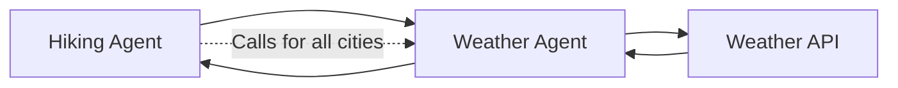
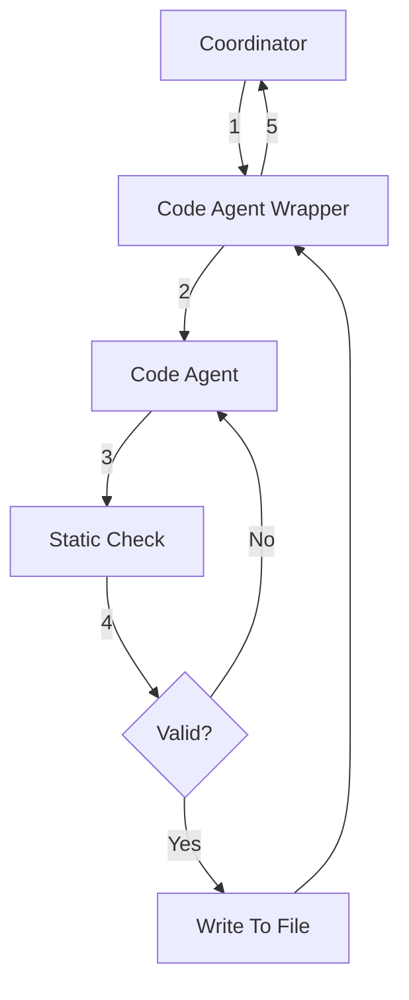
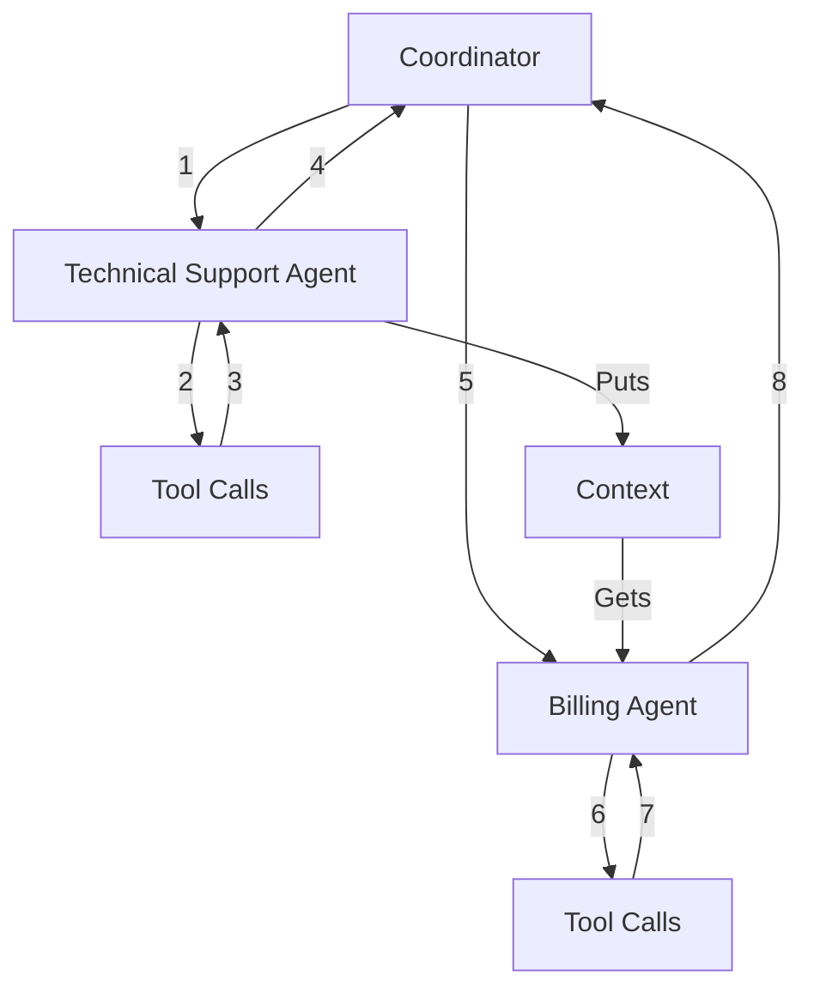

# Controlling Flows and Wrapping Nodes

RailTracks makes it easy to create custom agents with access to tools they can call to complete tasks. But what if you want to use agents themselves as tools? In this section, we’ll explore more complex flows and how RailTracks gives you control over them.

To start, let’s look at the simplest case: an agent that uses another agent as a tool.

### Example
```python

--8<-- "docs/scripts/flows.py:hiking_example"
```
You can see here that the flow will look like this



## Another Simple Flow but Using Context to Ensure Precise Outputs

Specialized agents perform better than generalist ones. For the simplest of coding projects, you might use a Top Level Agent for ideation and dialogue, a Coding Agent for the code itself, and a Static Checker for validation. It would be important that once the Static Checker approves code, no agents modify it further though. 

One important aspect of RailTracks is that it handles these complex flows through wrappers. All functions and flows can become nodes that you can run by wrapping them with `function_node`.

 In the following example you'll see an example of how RailTracks deals with mid-flow validation.

### Example
```python
--8<-- "docs/scripts/flows.py:coding_example"
```
### What this flow would look like



!!! info "Structuring Flows"
    When possible, you should try to keep your flows linear. Notice above that it would also be possible to give the coordinator access to both the static checker as well as the coding agent. In such a simple example, likely this would have been fine but two problems arise with this approach. Firstly, this is a simple validation step that should happen every time code is generated. Leaving it up to the coordinator to call the static checker adds unnecessary complexity to the agent and creates the possibility for the the validation step to be skipped. It can sometimes be easier to think about a more flexible flow but you try to linearize your flow as much as possible. The second problem we will discuss below.


## Handling More Complex Flows
While `function_node` works well for linear flows, some scenarios require transferring between different agents like moving from technical support to billing in a customer service system.
In these cases, you need to pass data directly between agents without mutations or the "telephone game" effect of traditional handoffs. RailTracks solves this with [context](../advanced_usage/context.md), a mechanism for sharing data across agent transfers while preserving integrity.
Let's see how context enables reliable multi-agent workflows.

### Customer Service Agents
```python

--8<-- "docs/scripts/flows.py:customer_example"
```

### What an example flow would look like

