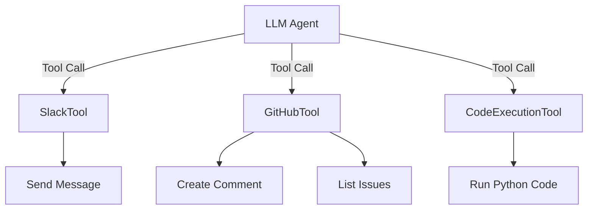

# 🛠️ Tools

One of the most important parts of any agentic system is the **set of tools** that the agent can use.

While an LLM on its own can understand and generate language, it's the ability to *use tools* that transforms it from a chatbot into a true **agent** capable of taking action, solving problems, and achieving real-world goals.

## 🤖 What Is a Tool?

A **tool** is an action the agent can take in the external world.

At a technical level, tools are often defined as **functions** that the agent can call. Large Language Models (LLMs) like OpenAI’s or Anthropic’s support something called `tool_calls` or `function_calls`. These allow the LLM to output structured `JSON`.

!!! info "Common Tools"
    * 🔍 Search the web
    * 🖥️ Execute code in a sandbox
    * 📨 Send a message to Slack
    * 🔗 Call a REST API
    * 📂 Read or write to a file system

Think of tools as the **hands and eyes** of your agent: they allow it to act beyond just thinking and talking.

## ⚙️ Example: Connecting Tools to an Agent

Here’s a conceptual diagram of an LLM agent using tools to interact with different systems:

!!! info "Each tool defines:"

    * **Name**: the identifier used by the agent (e.g. `post_to_slack`)
    * **Description**: a brief explanation of what the tool does (e.g. "Posts a message to a Slack channel")
    * **Parameters**: the inputs the agent must provide (e.g. message, channel)
    * **Function**: the logic the tool actually executes (e.g. send HTTP request)

## 💡 Why Tools Matter

Without tools, LLMs are limited to just generating language.

With tools, agents can:

* Automatically debug code
* File support tickets
* Summarize incoming Slack messages
* Generate and send reports
* Chain actions across different services

## 📚 Related Topics

* [Agents](../agents)

    <a href="../../../tools_mcp" class="md-button" style="margin:3px">Check out RailTracks Tools</a>

